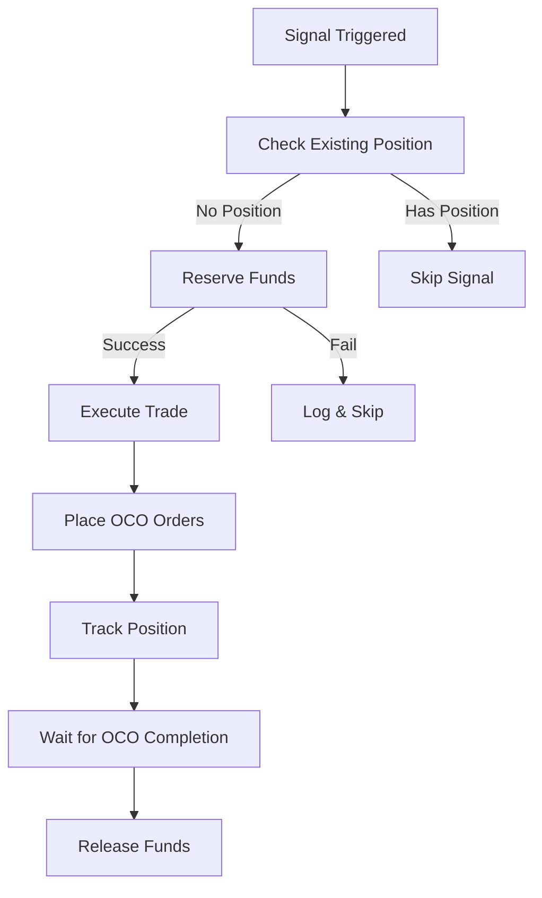

# Allocation Strategy Implementation Guide

## Overview

This guide explains how the allocation management system works with your 33.3% parameter sets configuration to ensure proper fund distribution and prevent conflicts.

## Your Current Configuration

```json
{
  "parameterSets": [
    {
      "symbol": "BTCUSDT",
      "allocationPercent": 33.3,
      "zScoreThreshold": 5.0,
      "profitPercent": 15.0,
      "stopLossPercent": 2
    },
    {
      "symbol": "BNBUSDT", 
      "allocationPercent": 33.3,
      "zScoreThreshold": 7.0,
      "profitPercent": 20.0,
      "stopLossPercent": 30
    },
    {
      "symbol": "ETHUSDT",
      "allocationPercent": 33.3,
      "zScoreThreshold": 6.0,
      "profitPercent": 22.0,
      "stopLossPercent": 6
    }
  ]
}
```

## How the Allocation System Works

### 1. Account Balance Division
- **Total Account**: $1000 (example)
- **BTC Reserve**: $333.33 (33.3%)
- **BNB Reserve**: $333.33 (33.3%)  
- **ETH Reserve**: $333.33 (33.3%)

### 2. Signal Processing Flow



### 3. Fund Reservation Logic

```typescript
// When BTC signal triggers
if (BTCUSDT signal >= 5.0) {
  // Reserve exactly $333.33 from account
  // Even if ETH/BNB already trading
  // Funds are protected until position closes
}
```

### 4. Concurrent Trading Example

**Scenario**: All three signals trigger simultaneously

```
Initial Balance: $1000

T+0: BTC Signal (Z=5.2)
  ✅ Reserve $333.33 for BTC
  ✅ Execute BTC buy order  
  ✅ Place OCO: TP=+15%, SL=-2%

T+1: ETH Signal (Z=6.1)  
  ✅ Reserve $333.33 for ETH
  ✅ Execute ETH buy order
  ✅ Place OCO: TP=+22%, SL=-6%

T+2: BNB Signal (Z=7.3)
  ✅ Reserve $333.33 for BNB  
  ✅ Execute BNB buy order
  ✅ Place OCO: TP=+20%, SL=-30%

Result: All three positions active, $0 remaining balance
```

## Starting Live Trading

### Step 1: Verify Configuration
```bash
cat config/live-params.json
# Confirm all allocationPercent = 33.3
```

### Step 2: Test with Paper Trading
```bash
# Test the allocation logic safely
npm run startTrading -- --paper --parameterSets=config/live-params.json
```

### Step 3: Start Live Trading  
```bash
# Real money with your allocation strategy
npm run startTrading -- --parameterSets=config/live-params.json
```

## Monitoring Your Allocations

### Console Output
You'll see allocation tracking:
```
💰 Account balance updated: $1000.00
💼 Reserved $333.30 (33.3%) for BTCUSDT
💼 Total reserved: $333.30 / $1000.00
🔥 LIVE BUY: BTCUSDT - Market order executed
   Allocated: $333.30 (33.3%)
```

### Allocation Status
Check current allocations:
```javascript
// In your monitoring code
const status = tradingEngine.getAllocationStatus();
console.log(JSON.stringify(status, null, 2));
```

Output:
```json
{
  "totalBalance": 1000.00,
  "totalReserved": 666.60,
  "availableBalance": 333.40,
  "allocationPercentage": 66.66,
  "reservations": [
    {
      "symbol": "BTCUSDT",
      "reservedAmount": 333.30,
      "timestamp": "2024-01-15T10:05:00Z",
      "orderId": "12345"
    },
    {
      "symbol": "ETHUSDT", 
      "reservedAmount": 333.30,
      "timestamp": "2024-01-15T10:06:00Z",
      "orderId": "12346"
    }
  ]
}
```

## Safety Features

### 1. No Over-Allocation
- System prevents spending more than allocated
- Each symbol gets exactly its reserved amount
- Concurrent signals handled safely

### 2. Position Limits
- Only one position per symbol at a time
- Existing positions block new signals for same symbol
- Reservations cleared when positions close

### 3. Fund Release on Exit
- OCO completion releases reserved funds
- Z-score reversal releases reserved funds  
- Emergency stops clear all reservations

### 4. Error Handling
```typescript
// If insufficient funds
console.log("❌ Failed to reserve funds for BTCUSDT: Insufficient funds");

// If already has position
console.log("Already have position in BTCUSDT, skipping buy signal");

// On successful reservation  
console.log("💼 Reserved $333.30 (33.3%) for BTCUSDT");
```

## Risk Management Benefits

### 1. Predictable Exposure
- Maximum risk per symbol: 33.3% of account
- Maximum total exposure: 100% (all three positions)
- No unexpected over-allocation

### 2. Portfolio Balance
- Equal weighting across three strategies
- Different risk/reward profiles per symbol
- Diversified parameter sets

### 3. Capital Efficiency
- 100% capital utilization when all signals active
- No idle funds during high-signal periods
- Automatic rebalancing as positions close

## Troubleshooting

### Issue: "Failed to reserve funds"
**Cause**: Account balance insufficient or already fully allocated
**Solution**: Check allocation status, wait for position closures, or add funds

### Issue: "Already have position" 
**Cause**: Symbol already has active position
**Solution**: This is normal - wait for OCO completion or Z-score reversal

### Issue: Partial fills
**Cause**: Market conditions or insufficient liquidity  
**Solution**: System handles partial fills automatically, OCO placed on executed quantity

### Emergency Reset
If allocations get stuck:
```javascript
await tradingEngine.clearAllAllocations();
```

## Expected Behavior

With your configuration, the system will:

1. **Monitor** all three symbols (BTC, BNB, ETH) continuously
2. **Reserve** 33.3% of account when each signal triggers
3. **Execute** market buy with reserved amount
4. **Place** OCO orders immediately (TP/SL based on your params)
5. **Track** positions until OCO completion or Z-score reversal
6. **Release** reserved funds when position closes
7. **Repeat** process for new signals

This ensures your account is always divided into three equal parts, with each parameter set getting its fair allocation regardless of market timing or signal concurrency.