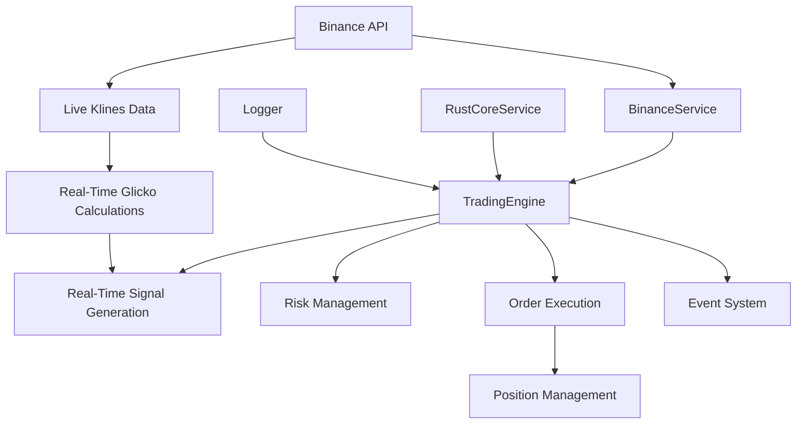

# Comprehensive Live Trading Bot System Guide

## Table of Contents

1. [System Overview](#system-overview)
2. [Architecture Deep Dive](#architecture-deep-dive)
3. [Data Flow Pipeline](#data-flow-pipeline)
4. [Glicko-2 Rating System Implementation](#glicko-2-rating-system-implementation)
5. [Signal Generation Process](#signal-generation-process)
6. [Order Execution & Management](#order-execution--management)
7. [Risk Management Systems](#risk-management-systems)
8. [Paper Trading vs Live Trading](#paper-trading-vs-live-trading)
9. [Real-time Monitoring & Events](#real-time-monitoring--events)
10. [Database Schema & Data Management](#database-schema--data-management)
11. [Error Handling & Recovery](#error-handling--recovery)
12. [Configuration & Parameter Management](#configuration--parameter-management)
13. [Startup and Shutdown Procedures](#startup-and-shutdown-procedures)
14. [Troubleshooting & Monitoring](#troubleshooting--monitoring)

---

## System Overview

The Live Trading Bot is a sophisticated algorithmic trading system that uses the **Glicko-2 rating algorithm** to evaluate cryptocurrency performance and make automated trading decisions. The system operates **database-independently**, downloading real-time market data, calculating dynamic Glicko ratings for individual coins, and generating trading signals based on statistical cross-coin analysis - exactly like the backtest system.

### Key Features

- **Database-Independent Operation**: No database dependency - calculates real-time ratings just like backtest system
- **Individual Coin Analysis**: Processes BASE_COINS (BTC, ETH, BNB, etc.) and their ratings, not symbols
- **Real-Time Glicko Calculations**: Downloads 5-minute klines and calculates ratings with moving average feed-through
- **Cross-Coin Z-Score Analysis**: Compares each coin's rating against all monitored coins for signal generation  
- **OCO Order Management**: Automatic take-profit and stop-loss order placement
- **Z-Score Reversal Detection**: Dynamic position closing based on statistical analysis
- **Paper Trading Mode**: Full simulation capability for testing and validation
- **Multi-Symbol Support**: Monitors all BASE_COINS but only trades symbols in parameter sets
- **Parameter Set Management**: Symbol-specific optimized trading parameters
- **Comprehensive Risk Management**: Multiple layers of protection and validation
- **Event-Driven Architecture**: Real-time monitoring and alerting system

### Core Philosophy

1. **Data-Driven Decisions**: All trading decisions based on quantitative Glicko-2 analysis
2. **Risk-First Approach**: Multiple layers of risk management protect capital
3. **Real-Time Processing**: Continuous market monitoring with timely execution
4. **Transparency**: Complete audit trail of all decisions and trades
5. **Scalability**: Designed to handle multiple trading pairs simultaneously

---

## Architecture Deep Dive

### System Components



#### 1. TradingEngine (src/node-api/services/TradingEngine.ts)

**Primary Function**: Central orchestrator of the entire trading workflow

**Key Responsibilities**:
- Manages trading state (running/stopped/paused)
- Coordinates data collection and signal generation
- Executes trading decisions with risk validation
- Monitors portfolio health and position management
- Handles emergency stops and graceful shutdowns
- Manages both paper and live trading modes

**Core State Management**:
```typescript
interface TradingState {
  isRunning: boolean;
  totalTrades: number;
  successfulTrades: number;
  failedTrades: number;
  currentDrawdown: number;
  dailyPnL: number;
  lastTradeTime?: Date;
  activeSignals: ZScoreSignal[];
  activePositions: Map<string, ActivePosition>;
  parameterSets: Map<string, TradingParameterSet>;
}
```

**Event-Driven Operations**:
- Listens to Binance service events (order placement, errors, price updates)
- Emits trading events (signals, trades, errors) for monitoring
- Processes signals asynchronously with cooldown management

#### 2. BinanceService (src/node-api/services/BinanceService.ts)

**Primary Function**: Interface layer to Binance exchange

**Key Responsibilities**:
- Real-time price data collection via WebSocket streams
- Order placement and management (Market, Limit, OCO orders)
- Account information retrieval and balance management
- Position tracking and order status monitoring
- API connection management and reconnection logic

**Order Types Supported**:
- **MARKET**: Immediate execution at current market price
- **LIMIT**: Execution only when price reaches specified level
- **OCO**: One-Cancels-Other for automated take-profit/stop-loss

**Real-time Data Streaming**:
```typescript
// WebSocket price streaming for all monitored symbols
async startPriceStreaming(symbols: string[]): Promise<void> {
  for (const symbol of symbols) {
    const stream = this.client.ws.ticker(symbol, (ticker: any) => {
      this.emit('priceUpdate', {
        symbol: ticker.symbol,
        price: parseFloat(ticker.curDayClose),
        change: parseFloat(ticker.priceChangePercent),
        volume: parseFloat(ticker.volume),
        timestamp: new Date()
      });
    });
    this.priceSubscriptions.set(symbol, stream);
  }
}
```

#### 3. RustCoreService (src/node-api/services/RustCoreService.ts)

**Primary Function**: High-performance computational backend

**Key Responsibilities**:
- Glicko-2 rating calculations
- Statistical analysis and Z-score computations
- Performance metric calculations
- Optimization algorithms for parameter tuning

#### 4. Logger System (src/services/Logger.ts)

**Primary Function**: Comprehensive logging and audit trail

**Log Categories**:
- **ENGINE**: Trading engine state changes and operations
- **SIGNALS**: Z-score calculations and signal generation
- **TRADING**: Order execution and position management
- **REVERSAL**: Z-score reversal detection and exits
- **PAPER_TRADE**: Paper trading simulation events
- **ERROR**: Error conditions and recovery actions

---

## Data Flow Pipeline

### Phase 1: Market Data Ingestion

#### Step 1: Real-Time Price Collection
```typescript
// Continuous WebSocket streams from Binance
const binanceWS = new WebSocket('wss://stream.binance.com:9443/ws/!ticker@arr');

binanceWS.onmessage = (event) => {
  const tickers = JSON.parse(event.data);
  tickers.forEach(ticker => {
    if (isMonitoredSymbol(ticker.s)) {
      processTickerUpdate({
        symbol: ticker.s,
        price: parseFloat(ticker.c),
        volume: parseFloat(ticker.v),
        priceChange: parseFloat(ticker.P),
        timestamp: Date.now()
      });
    }
  });
};
```

#### Step 2: Historical Data Integration
For paper trading mode, the system fetches recent klines data:

```typescript
// Fetch 5-minute klines for Glicko calculations
const klines = await this.binanceService.getKlines(
  symbol,
  '5m',
  Date.now() - totalPeriodsNeeded * 5 * 60 * 1000,
  undefined,
  totalPeriodsNeeded
);
```

### Phase 2: Database-Independent Real-Time Glicko Calculation

#### Unified Real-Time Processing (Both Live & Paper Trading)
**IMPORTANT CHANGE**: The system now works **identically to the backtest system** - no database dependency!

Both live and paper trading modes now calculate Glicko ratings in real-time using market performance:

**Step 1: Download Individual Coin Data**
```typescript
// Get all BASE_COINS from environment (exclude USDT since USDTUSDT is invalid)
const baseCoins = (process.env.BASE_COINS?.split(',').map(coin => coin.trim()) || [])
  .filter(coin => coin !== 'USDT');
const monitoringSymbols = baseCoins.map(coin => `${coin}USDT`);

// Download n (moving_averages) number of 5-minute klines for each coin
for (const symbol of monitoringSymbols) {
  const klines = await this.binanceService.getKlines(
    symbol,
    '5m', // 5-minute intervals
    Date.now() - totalPeriodsNeeded * 5 * 60 * 1000,
    undefined,
    totalPeriodsNeeded
  );
}
```

**Step 2: Calculate Sequential Glicko Ratings**
The system calculates Glicko ratings for each 5-minute interval where the previous interval's rating feeds into the next:

```typescript
// Start with initial Glicko values for each coin
let currentRating = 1500;
let currentRatingDeviation = 350;
let currentVolatility = 0.06;

// Calculate ratings for each interval (starting from second kline)
for (let i = 1; i < klines.length; i++) {
  const prevKline = klines[i - 1];
  const currKline = klines[i];
  
  // Calculate price performance for this interval
  const priceChange = (currKline.close - prevKline.close) / prevKline.close;
  
  // Performance-to-game-result conversion
  let gameResult: number;
  if (Math.abs(priceChange) < 0.001) { // < 0.1% change = draw
    gameResult = 0.5;
  } else if (priceChange > 0) { // Price up = win
    gameResult = Math.min(1.0, 0.5 + priceChange * 50);
  } else { // Price down = loss  
    gameResult = Math.max(0.0, 0.5 + priceChange * 50);
  }
  
  // Update Glicko rating (previous interval feeds into next)
  const updatedRating = this.updateGlickoRating(
    currentRating,           // Previous interval's rating
    currentRatingDeviation,  // Previous interval's deviation
    currentVolatility,       // Previous interval's volatility
    opponentRating,
    opponentRatingDeviation,
    gameResult,
    tau
  );
  
  // Update current values for next interval
  currentRating = updatedRating.rating;
  currentRatingDeviation = updatedRating.ratingDeviation;
  currentVolatility = updatedRating.volatility;
}
```

**Step 3: Individual Coin Rating Storage**
```typescript
// Store final rating for this coin (not symbol)
ratings.push({
  symbol: baseAsset,        // e.g., 'BTC' not 'BTCUSDT'
  timestamp: now,
  rating: currentRating,    // Final rating after all intervals
  ratingDeviation: currentRatingDeviation,
  volatility: currentVolatility,
  movingAveragesPeriod: movingAveragesPeriod,
  glickoRatingsCount: klines.length - 1
});
```
```

**Glicko-2 Update Algorithm**:
1. Convert to Glicko-2 scale: `μ = (rating - 1500) / 173.7178`
2. Calculate variance and expected score
3. Update volatility using iterative algorithm
4. Update rating deviation and final rating
5. Convert back to original scale

### Phase 3: Cross-Coin Z-Score Analysis & Signal Generation

#### Cross-Coin Statistical Analysis
**CRITICAL**: The system calculates Z-scores by comparing each individual coin's Glicko rating against **ALL monitored coins** - exactly like the backtest system:

```typescript
// Step 1: Calculate cross-coin statistics for this interval
// Uses individual coin ratings (BTC, ETH, BNB, etc.) not symbols
const allRatingValues = ratings.map(r => parseFloat(r.rating.toString()));
const meanRating = allRatingValues.reduce((sum, rating) => sum + rating, 0) / allRatingValues.length;
const variance = allRatingValues.reduce((sum, rating) => sum + Math.pow(rating - meanRating, 2), 0) / allRatingValues.length;
const stdDevRating = Math.sqrt(variance);

console.log(`Cross-coin statistics: mean=${meanRating.toFixed(1)}, σ=${stdDevRating.toFixed(1)} across ${ratings.length} coins`);

// Step 2: Calculate individual coin Z-scores
for (const rating of ratings) {
  const tradingSymbol = `${rating.symbol}USDT`; // Convert BTC -> BTCUSDT
  const ratingValue = parseFloat(rating.rating.toString());
  
  // Z-score = (individual_coin_rating - mean_of_all_coins) / std_dev_of_all_coins
  const zScore = stdDevRating > 0 ? (ratingValue - meanRating) / stdDevRating : 0;
  currentZScores[tradingSymbol] = zScore;
}
```

#### Moving Average Z-Score Calculation with Feed-Through
**CRITICAL**: Each coin maintains its own Z-score history where previous intervals feed into the next:

```typescript
// Step 3: Update Z-score history for each coin with feed-through
for (const rating of ratings) {
  const tradingSymbol = `${rating.symbol}USDT`;
  const currentZScore = currentZScores[tradingSymbol];
  
  // Store this Z-score in the coin's history for moving average calculation
  if (!this.zScoreHistory.has(tradingSymbol)) {
    this.zScoreHistory.set(tradingSymbol, []);
  }
  
  const history = this.zScoreHistory.get(tradingSymbol)!;
  history.push({
    timestamp: new Date(),
    zScore: currentZScore,      // Current interval's Z-score
    rating: ratingValue         // Current interval's rating
  });
  
  // Keep only required history (parameter-specific moving averages)
  const params = this.getParametersForSymbol(tradingSymbol);
  const movingAveragesPeriod = params.movingAverages;
  
  if (history.length > movingAveragesPeriod + 10) { // Keep extra for safety
    history.shift(); // Remove oldest
  }
  
  // Calculate moving average Z-score if sufficient history
  let movingAverageZScore = currentZScore; // Default to current
  if (history.length >= movingAveragesPeriod) {
    const recentZScores = history.slice(-movingAveragesPeriod);
    movingAverageZScore = recentZScores.reduce((sum, h) => sum + h.zScore, 0) / recentZScores.length;
  }
  
  console.log(`[${tradingSymbol}] Current Z: ${currentZScore.toFixed(3)}, MA Z-score: ${movingAverageZScore.toFixed(3)} (${movingAveragesPeriod}), History: ${history.length}`);
}
```

#### Signal Generation Logic - Trading vs Monitoring
**CRITICAL**: The system monitors ALL BASE_COINS but only generates trading signals for symbols in parameter sets:

```typescript
// Step 4: Generate trading signals based on moving average Z-score threshold
for (const rating of ratings) {
  const tradingSymbol = `${rating.symbol}USDT`;
  const movingAverageZScore = /* calculated above */;
  
  // Determine if this symbol can trade (is in parameter sets)
  const isInParameterSet = this.state.parameterSets.has(tradingSymbol);
  const params = this.getParametersForSymbol(tradingSymbol);
  const threshold = params.zScoreThreshold;
  
  if (isInParameterSet && Math.abs(movingAverageZScore) >= threshold) {
    const signal = movingAverageZScore > 0 ? 'BUY' : 'SELL';
    console.log(`🚨 TRADING SIGNAL: ${signal} ${tradingSymbol} (MA Z-score: ${movingAverageZScore.toFixed(3)} >= ±${threshold})`);
    
    allSignals.push({
      symbol: tradingSymbol,
      timestamp: new Date(),
      currentRating: ratingValue,
      movingAverage: meanRating,
      standardDeviation: stdDevRating,
      zScore: movingAverageZScore,
      signal: signal as 'BUY' | 'SELL'
    });
  } else if (!isInParameterSet) {
    console.log(`📊 [${tradingSymbol}] MA Z-score: ${movingAverageZScore.toFixed(3)} (monitoring only - no trading)`);
  }
}
```

**Key Points**:
- **ALL BASE_COINS monitored**: System processes BTC, ETH, BNB, XRP, SOL, ADA, DOGE, POL, AVAX, LINK, XLM, TRX (from environment)
- **Only parameter set symbols trade**: Only symbols configured in `config/live-params.json` can execute trades
- **Cross-coin normalization**: Z-scores calculated relative to ALL monitored coins for market-wide context
- **Symbol-specific thresholds**: Each trading symbol has its own Z-score threshold and moving average period

### Phase 4: Risk Management Validation

#### Multi-Layer Risk Checks
```typescript
private passesRiskChecks(signal: ZScoreSignal): boolean {
  // Daily loss limit
  if (this.state.dailyPnL <= -this.config.riskManagement.maxDailyLoss) {
    console.log('Daily loss limit reached, skipping trades');
    return false;
  }

  // Maximum drawdown
  if (this.state.currentDrawdown >= this.config.riskManagement.maxDrawdown) {
    console.log('Maximum drawdown reached, skipping trades');
    return false;
  }

  // Position limits
  const activePositions = this.binanceService.getActivePositions();
  if (signal.signal === 'BUY' && activePositions.size >= this.config.maxPositions) {
    console.log('Maximum positions reached, skipping buy signal');
    return false;
  }

  return true;
}
```

### Phase 5: Order Execution

#### Live Trading Execution Flow
```typescript
async executeLiveTrade(signal: ZScoreSignal): Promise<void> {
  // Step 1: Calculate position size
  const account = await this.binanceService.getAccountInfo();
  const usdtBalance = account.balances.find(b => b.asset === 'USDT');
  const availableUsdt = parseFloat(usdtBalance?.free || '0');
  const allocationAmount = availableUsdt * (params.allocationPercent / 100);

  // Step 2: Place market buy order
  const buyOrder = await this.binanceService.placeOrder({
    symbol: signal.symbol,
    side: 'BUY',
    type: 'MARKET',
    quoteOrderQty: allocationAmount.toFixed(2)
  });

  // Step 3: Immediately place OCO sell order
  const executedQuantity = parseFloat(buyOrder.executedQty);
  const avgPrice = parseFloat(buyOrder.cummulativeQuoteQty) / executedQuantity;
  
  const takeProfitPrice = (avgPrice * (1 + params.profitPercent / 100)).toFixed(8);
  const stopLossPrice = (avgPrice * (1 - params.stopLossPercent / 100)).toFixed(8);

  const ocoOrder = await this.binanceService.placeOcoOrder(
    signal.symbol,
    'SELL',
    executedQuantity.toFixed(8),
    takeProfitPrice,
    stopLossPrice,
    stopLimitPrice
  );

  // Step 4: Track the active position
  this.state.activePositions.set(symbol, {
    symbol,
    entryPrice: avgPrice,
    quantity: executedQuantity,
    entryTime: new Date(),
    buyOrderId: buyOrder.orderId,
    ocoOrderId: ocoOrder.orderListId,
    takeProfitPrice: parseFloat(takeProfitPrice),
    stopLossPrice: parseFloat(stopLossPrice),
    parameters: params
  });
}
```

---

## Glicko-2 Rating System Implementation

### Core Algorithm Components

#### 1. Rating Scale Conversion
```typescript
// Convert to Glicko-2 scale (μ, φ, σ)
const mu = (rating - 1500) / 173.7178;        // Centered rating
const phi = ratingDeviation / 173.7178;       // Scaled deviation  
const sigma = volatility;                      // Volatility unchanged
```

#### 2. Opponent Rating Calculation
```typescript
// Market conditions determine "opponent strength"
const marketVolatility = this.calculateVolatility(recentKlines);
const volumeRatio = currKline.volume / (prevKline.volume || 1);
const opponentRating = 1500 + (marketVolatility * 1000) + (Math.log(volumeRatio) * 100);
```

#### 3. Game Result Determination
```typescript
// Price performance maps to game outcomes
const priceChange = (currKline.close - prevKline.close) / prevKline.close;

if (Math.abs(priceChange) < 0.001) {
  gameResult = 0.5; // Draw
} else if (priceChange > 0) {
  gameResult = Math.min(1.0, 0.5 + priceChange * 50); // Win (scaled)
} else {
  gameResult = Math.max(0.0, 0.5 + priceChange * 50); // Loss (scaled)
}
```

#### 4. Rating Update Process
```typescript
// Glicko-2 update equations
const g = (phi: number) => 1 / Math.sqrt(1 + 3 * phi * phi / (Math.PI * Math.PI));
const E = (mu: number, muOpponent: number, phiOpponent: number) => 
  1 / (1 + Math.exp(-g(phiOpponent) * (mu - muOpponent)));

const gPhi = g(phiOpponent);
const expectedScore = E(mu, muOpponent, phiOpponent);
const variance = 1 / (gPhi * gPhi * expectedScore * (1 - expectedScore));

// Update calculations
const delta = variance * gPhi * (gameResult - expectedScore);
const newSigma = Math.sqrt(sigma * sigma + delta * delta / variance);
const newPhiSquared = 1 / (1 / (phi * phi + newSigma * newSigma) + 1 / variance);
const newPhi = Math.sqrt(newPhiSquared);
const newMu = mu + newPhiSquared * gPhi * (gameResult - expectedScore);

// Convert back to original scale
return {
  rating: newMu * 173.7178 + 1500,
  ratingDeviation: newPhi * 173.7178,
  volatility: Math.min(0.2, Math.max(0.01, newSigma))
};
```

---

## Signal Generation Process

### 1. Data Collection Phase

Every 5 minutes, the system:
- Fetches latest price data for all BASE_COINS symbols
- Calculates or retrieves Glicko ratings
- Updates Z-score history for each symbol

### 2. Cross-Market Analysis

```typescript
// Calculate statistics across ALL monitored coins
const allRatingValues = ratings.map(r => parseFloat(r.rating.toString()));
const meanRating = allRatingValues.reduce((sum, rating) => sum + rating, 0) / allRatingValues.length;
const variance = allRatingValues.reduce((sum, rating) => sum + Math.pow(rating - meanRating, 2), 0) / allRatingValues.length;
const stdDevRating = Math.sqrt(variance);

console.log(`Cross-coin statistics: mean=${meanRating.toFixed(1)}, σ=${stdDevRating.toFixed(1)} across ${ratings.length} coins`);
```

### 3. Z-Score Calculation & Moving Average

For each symbol:
```typescript
// Current Z-score calculation
const zScore = stdDevRating > 0 ? (ratingValue - meanRating) / stdDevRating : 0;

// Update Z-score history
const history = this.zScoreHistory.get(symbol) || [];
history.push({ timestamp: new Date(), zScore: zScore, rating: ratingValue });

// Calculate moving average Z-score
if (history.length >= movingAveragesPeriod) {
  const recentZScores = history.slice(-movingAveragesPeriod);
  movingAverageZScore = recentZScores.reduce((sum, h) => sum + h.zScore, 0) / recentZScores.length;
}
```

### 4. Signal Threshold Evaluation

```typescript
// Check if symbol can trade and signal strength
const isInParameterSet = this.state.parameterSets.has(symbol);
const threshold = isInParameterSet ? params.zScoreThreshold : this.config.zScoreThreshold;

if (isInParameterSet && Math.abs(movingAverageZScore) >= params.zScoreThreshold) {
  const signal = movingAverageZScore > 0 ? 'BUY' : 'SELL';
  console.log(`🚨 TRADING SIGNAL: ${signal} ${symbol} (Z-score: ${movingAverageZScore.toFixed(3)})`);
  
  allSignals.push({
    symbol: symbol,
    timestamp: new Date(),
    currentRating: ratingValue,
    movingAverage: meanRating,
    standardDeviation: stdDevRating,
    zScore: movingAverageZScore,
    signal: signal as 'BUY' | 'SELL'
  });
}
```

---

## Order Execution & Management

### OCO (One-Cancels-Other) Order System

The system uses OCO orders to implement automated take-profit and stop-loss functionality:

#### OCO Order Placement
```typescript
async placeOcoOrder(
  symbol: string,
  side: 'BUY' | 'SELL',
  quantity: string,
  price: string,        // Take-profit price
  stopPrice: string,    // Stop-loss trigger price
  stopLimitPrice: string // Stop-loss limit price (slightly lower)
): Promise<any> {
  const order = await this.client.orderOco({
    symbol,
    side,
    quantity,
    price,
    stopPrice,
    stopLimitPrice,
    stopLimitTimeInForce: 'GTC'
  });
  
  return order;
}
```

#### Position Tracking
```typescript
interface ActivePosition {
  symbol: string;
  entryPrice: number;
  quantity: number;
  entryTime: Date;
  buyOrderId: string;
  ocoOrderId: string;
  takeProfitOrderId?: string;
  stopLossOrderId?: string;
  takeProfitPrice: number;
  stopLossPrice: number;
  zScoreThreshold: number;
  parameters: TradingParameterSet;
}
```

### Z-Score Reversal Detection

The system continuously monitors Z-scores for active positions:

```typescript
private async checkForZScoreReversals(): Promise<void> {
  for (const [symbol, position] of this.state.activePositions) {
    const currentZScore = this.previousZScores.get(symbol);
    const params = position.parameters;
    
    // Check if Z-score has reversed (crossed negative threshold)
    if (currentZScore <= -params.zScoreThreshold) {
      console.log(`Z-score reversal: ${symbol} ${currentZScore.toFixed(2)} <= -${params.zScoreThreshold}`);
      
      // Cancel existing OCO orders
      if (position.ocoOrderId) {
        await this.binanceService.cancelOrder(symbol, position.ocoOrderId);
      }

      // Execute market sell for entire position
      const sellOrder = await this.binanceService.placeOrder({
        symbol,
        side: 'SELL',
        type: 'MARKET',
        quantity: position.quantity.toString()
      });

      // Remove position from tracking
      this.state.activePositions.delete(symbol);
      this.emit('zScoreReversal', { symbol, position, sellOrder });
    }
  }
}
```

---

## Risk Management Systems

### Multi-Layer Risk Framework

#### 1. Pre-Trade Risk Checks
```typescript
private passesRiskChecks(signal: ZScoreSignal): boolean {
  // Daily loss limit
  if (this.state.dailyPnL <= -this.config.riskManagement.maxDailyLoss) {
    this.emit('riskLimitHit', 'dailyLoss');
    return false;
  }

  // Maximum drawdown
  if (this.state.currentDrawdown >= this.config.riskManagement.maxDrawdown) {
    this.emit('riskLimitHit', 'maxDrawdown');
    return false;
  }

  // Position count limits
  const activePositions = this.binanceService.getActivePositions();
  if (signal.signal === 'BUY' && activePositions.size >= this.config.maxPositions) {
    console.log('Maximum positions reached');
    return false;
  }

  return true;
}
```

#### 2. Position Sizing Algorithm
```typescript
// Calculate position size based on allocation percentage
const params = this.getParametersForSymbol(signal.symbol);
const allocationPercent = params.allocationPercent || 10;
const allocationAmount = availableUsdt * (allocationPercent / 100);

// Apply minimum position requirements
if (allocationAmount < 10) { // Minimum $10 position
  console.log(`Insufficient allocation: $${allocationAmount.toFixed(2)}`);
  return;
}
```

#### 3. Cooldown Management
```typescript
// Failed trade cooldown system
private failedTradeCooldown: Map<string, Date> = new Map();

// Check cooldown before processing signal
const cooldownEnd = this.failedTradeCooldown.get(signal.symbol);
if (cooldownEnd && new Date() < cooldownEnd) {
  console.log(`Symbol ${signal.symbol} in cooldown until ${cooldownEnd}`);
  return;
}

// Set cooldown on failed trade
if (tradeFailure) {
  const cooldownEnd = new Date(Date.now() + this.config.riskManagement.cooldownPeriod * 60000);
  this.failedTradeCooldown.set(signal.symbol, cooldownEnd);
}
```

### Emergency Stop Procedures
```typescript
async emergencyStop(): Promise<void> {
  console.log('EMERGENCY STOP TRIGGERED');
  
  try {
    // 1. Stop the trading engine
    await this.stop();
    
    // 2. Cancel all open orders
    const openOrders = await this.prisma.productionOrders.findMany({
      where: { status: { in: ['NEW', 'PARTIALLY_FILLED'] } }
    });

    for (const order of openOrders) {
      try {
        await this.binanceService.cancelOrder(order.symbol, order.orderId);
      } catch (error) {
        console.error(`Failed to cancel order ${order.orderId}:`, error);
      }
    }

    this.emit('emergencyStop');
  } catch (error) {
    this.emit('emergencyStopError', error);
  }
}
```

---

## Paper Trading vs Live Trading

### Paper Trading Mode

**Purpose**: Full system simulation without real money at risk

**Features**:
- Real market data with simulated orders
- Virtual $10,000 starting balance
- Full OCO order simulation
- Real-time Glicko rating calculations
- Complete position tracking and P&L calculation

**Implementation**:
```typescript
// Paper trading execution
private async executePaperTrade(signal: ZScoreSignal): Promise<void> {
  const params = this.getParametersForSymbol(signal.symbol);
  const currentPrice = await this.binanceService.getCurrentPrice(signal.symbol);
  
  if (signal.signal === 'BUY') {
    // Calculate virtual position size
    const allocationPercent = params.allocationPercent || 10;
    const allocationAmount = this.paperTradingBalance * (allocationPercent / 100);
    const quantity = allocationAmount / currentPrice;
    
    // Create paper position
    const paperPosition: PaperPosition = {
      symbol: signal.symbol,
      entryPrice: currentPrice,
      quantity: quantity,
      entryTime: new Date(),
      takeProfitPrice: currentPrice * (1 + params.profitPercent / 100),
      stopLossPrice: currentPrice * (1 - params.stopLossPercent / 100),
      parameters: params,
      entryValue: allocationAmount
    };
    
    this.paperPositions.set(signal.symbol, paperPosition);
    this.paperTradingBalance -= allocationAmount;
  }
}
```

**Paper Position Updates**:
```typescript
private async updatePaperPositions(): Promise<void> {
  for (const [symbol, position] of this.paperPositions) {
    const currentPrice = await this.binanceService.getCurrentPrice(symbol);
    
    // Update unrealized P&L
    const currentValue = position.quantity * currentPrice;
    position.unrealizedPnL = currentValue - position.entryValue;
    position.unrealizedPnLPercent = (position.unrealizedPnL / position.entryValue) * 100;
    
    // Check OCO conditions
    if (currentPrice >= position.takeProfitPrice) {
      await this.closePaperPosition(symbol, currentPrice, 'TAKE_PROFIT');
    } else if (currentPrice <= position.stopLossPrice) {
      await this.closePaperPosition(symbol, currentPrice, 'STOP_LOSS');
    }
  }
}
```

### Live Trading Mode

**Purpose**: Real money trading with actual Binance orders

**Features**:
- Real Binance API order execution
- Actual OCO order placement
- Real-time balance and position management
- Database stored Glicko ratings
- Complete audit trail in production_orders table

**Key Differences**:
1. Uses pre-calculated Glicko ratings from database
2. Places real orders through Binance API  
3. Manages real account balances and positions
4. Implements full error handling and recovery
5. Maintains complete order audit trail

---

## Real-time Monitoring & Events

### Event-Driven Architecture

The system uses Node.js EventEmitter for real-time communication:

```typescript
class TradingEngine extends EventEmitter {
  // Core events emitted
  static readonly EVENTS = {
    STARTED: 'started',
    STOPPED: 'stopped', 
    ORDER_EXECUTED: 'orderExecuted',
    SIGNAL_GENERATED: 'signalGenerated',
    ZSCORE_REVERSAL: 'zScoreReversal',
    PAPER_TRADE: 'paperTrade',
    RISK_LIMIT_HIT: 'riskLimitHit',
    EMERGENCY_STOP: 'emergencyStop',
    TRADING_ERROR: 'tradingError'
  };
}
```

### Event Handlers

#### Signal Monitoring
```typescript
tradingEngine.on('signalsChecked', (data) => {
  const timestamp = new Date().toLocaleString();
  console.log(`📊 [${timestamp}] Signals: ${data.totalSignals} total, ${data.strongSignals} strong`);
});
```

#### Order Execution Tracking  
```typescript
tradingEngine.on('orderExecuted', (order) => {
  console.log(`💼 Order executed: ${order.side} ${order.symbol} - Qty: ${order.executedQty}`);
});
```

#### Risk Alert System
```typescript
tradingEngine.on('riskLimitHit', (type) => {
  console.warn(`⚠️ Risk limit hit: ${type}`);
  // Could trigger notifications, emergency stops, etc.
});
```

### Monitoring Loop

The system runs a continuous 5-minute monitoring cycle:

```typescript
private startMonitoring(): void {
  console.log('🔄 Starting monitoring loop - checking every 5 minutes');
  this.monitoringInterval = setInterval(async () => {
    try {
      console.log('🔄 Starting 5-minute signal check cycle...');
      await this.checkForSignals();
      console.log('✅ 5-minute signal check cycle completed');
    } catch (error) {
      console.error('❌ Error in monitoring loop:', error);
      this.emit('monitoringError', error);
    }
  }, 300000); // 5 minutes
}
```

---

## Database Independence & Data Management

### **CRITICAL CHANGE: Database-Free Operation**

**The live trading system now operates completely independently of any database**, exactly like the backtest system. This means:

#### ✅ What the System Does Now:
- **Real-time Glicko calculations**: Downloads klines and calculates ratings on-demand
- **In-memory data management**: All position tracking, P&L calculation, and state management in memory
- **Direct Binance API integration**: Order management through Binance API calls only
- **File-based logging**: Comprehensive logging to files for audit trail
- **Environment-based configuration**: Uses environment variables and JSON config files

#### ❌ What the System No Longer Uses:
- **No Glicko ratings database queries**: Calculates all ratings in real-time from market data
- **No order persistence**: Does not store orders in database (relies on Binance API for order status)
- **No klines storage**: Fetches klines directly from Binance API as needed
- **No database connections**: No PostgreSQL or Prisma dependencies

### In-Memory Data Management

#### Position Tracking
```typescript
// Active positions tracked in memory
private state: TradingState = {
  isRunning: boolean;
  totalTrades: number;
  successfulTrades: number;
  failedTrades: number;
  currentDrawdown: number;
  dailyPnL: number;
  activeSignals: ZScoreSignal[];
  activePositions: Map<string, ActivePosition>;  // In-memory tracking
  parameterSets: Map<string, TradingParameterSet>;
};

// Paper trading positions
private paperPositions: Map<string, PaperPosition> = new Map();

// Z-score history for moving averages
private zScoreHistory: Map<string, Array<{ timestamp: Date; zScore: number; rating: number }>> = new Map();
```

#### P&L Calculation (Database-Free)
```typescript
async updateDailyPnL(): Promise<void> {
  let dailyPnL = 0;

  // Calculate P&L from active positions (unrealized)
  for (const [symbol, position] of this.state.activePositions) {
    const currentPrice = await this.binanceService.getCurrentPrice(symbol);
    const unrealizedPnL = (currentPrice - position.entryPrice) * position.quantity;
    dailyPnL += unrealizedPnL;
  }

  // Calculate P&L from paper positions (unrealized)
  for (const [symbol, position] of this.paperPositions) {
    if (position.unrealizedPnL !== undefined) {
      dailyPnL += position.unrealizedPnL;
    }
  }

  this.state.dailyPnL = dailyPnL;
  this.emit('dailyPnLUpdated', dailyPnL);
}
```

#### Emergency Stop (Database-Free)
```typescript
async emergencyStop(): Promise<void> {
  // Cancel all tracked active positions' OCO orders
  for (const [symbol, position] of this.state.activePositions) {
    if (position.ocoOrderId) {
      await this.binanceService.cancelOrder(symbol, position.ocoOrderId);
    }
    
    // Get open orders directly from Binance API
    const openOrders = await this.binanceService.getOpenOrders(symbol);
    for (const order of openOrders) {
      await this.binanceService.cancelOrder(symbol, order.orderId.toString());
    }
  }

  // Clear all in-memory state
  this.state.activePositions.clear();
  this.paperPositions.clear();
  await this.clearAllAllocations();
}
```

---

## Error Handling & Recovery

### Comprehensive Error Management

#### Error Classification System
```typescript
enum ErrorSeverity {
  LOW = 'LOW',           // Log and continue
  MEDIUM = 'MEDIUM',     // Retry with backoff
  HIGH = 'HIGH',         // Pause symbol trading
  CRITICAL = 'CRITICAL'  // Emergency stop
}
```

#### Error Handling Implementation
```typescript
private async handleTradingError(
  error: Error,
  context: TradingContext,
  severity: ErrorSeverity
): Promise<void> {
  
  // Log error with full context
  await this.logger.error('TRADING', error.message, {
    error: error.stack,
    context,
    severity,
    timestamp: new Date()
  });
  
  switch (severity) {
    case ErrorSeverity.CRITICAL:
      await this.emergencyStop(`Critical error: ${error.message}`);
      break;
      
    case ErrorSeverity.HIGH:
      if (context.symbol) {
        this.pauseSymbolTrading(context.symbol, '5m');
      }
      break;
      
    case ErrorSeverity.MEDIUM:
      if (this.isRetryableError(error)) {
        await this.scheduleRetry(context, error);
      }
      break;
  }
}
```

#### Retry Logic with Exponential Backoff
```typescript
private async executeWithRetry<T>(
  operation: () => Promise<T>,
  maxAttempts: number = 3
): Promise<T> {
  let attempts = 0;
  
  while (attempts < maxAttempts) {
    try {
      return await operation();
    } catch (error) {
      attempts++;
      
      if (attempts >= maxAttempts) {
        throw error;
      }
      
      // Exponential backoff: 1s, 2s, 4s, 8s...
      const delay = Math.pow(2, attempts) * 1000;
      await this.sleep(delay);
    }
  }
  
  throw new Error('Max retry attempts exceeded');
}
```

#### Connection Recovery
```typescript
// WebSocket reconnection logic
ws.onclose = () => {
  setIsConnected(false);
  console.log('WebSocket connection lost, attempting to reconnect...');
  
  // Exponential backoff reconnection
  setTimeout(() => {
    connectWebSocket();
  }, Math.min(1000 * Math.pow(2, reconnectAttempts), 30000));
};
```

---

## Configuration & Parameter Management

### Trading Configuration Structure
```typescript
interface TradingConfig {
  zScoreThreshold: number;          // e.g., 3.0
  movingAveragesPeriod: number;     // e.g., 200
  profitPercent: number;            // e.g., 5.0
  stopLossPercent: number;          // e.g., 2.5
  maxPositions: number;             // e.g., 5
  allocationPerPosition: number;    // e.g., 10.0
  symbols: string[];                // e.g., ['BTCUSDT', 'ETHUSDT']
  enableLiveTrading: boolean;       // false for paper trading
  riskManagement: {
    maxDailyLoss: number;           // e.g., 100 (USDT)
    maxDrawdown: number;            // e.g., 10.0 (%)
    cooldownPeriod: number;         // e.g., 60 (minutes)
  };
}
```

### Parameter Set Management
```typescript
interface TradingParameterSet {
  symbol: string;                   // e.g., 'BTCUSDT'
  baseAsset: string;               // e.g., 'BTC'
  quoteAsset: string;              // e.g., 'USDT'
  zScoreThreshold: number;         // Symbol-specific threshold
  movingAverages: number;          // Symbol-specific MA period
  profitPercent: number;           // Symbol-specific profit target
  stopLossPercent: number;         // Symbol-specific stop loss
  allocationPercent?: number;      // Symbol-specific allocation
  enabled?: boolean;               // Enable/disable trading
}
```

### Environment Variables (Database-Free)
```bash
# Binance API Configuration
BINANCE_API_KEY=your_api_key_here
BINANCE_API_SECRET=your_api_secret_here
BINANCE_TESTNET=false

# BASE_COINS to Monitor (CRITICAL)
# All these coins will be monitored for Z-score calculations
# Only symbols in parameter sets will actually trade
BASE_COINS=BTC,ETH,XRP,SOL,ADA,DOGE,POL,AVAX,LINK,XLM,BNB,TRX

# Trading Parameters (Defaults)
Z_SCORE_THRESHOLD=3.0
MOVING_AVERAGES=200
PROFIT_PERCENT=5.0
STOP_LOSS_PERCENT=2.5
MAX_POSITIONS=5
ALLOCATION_PER_POSITION=10.0

# Risk Management
MAX_DAILY_LOSS=100
MAX_DRAWDOWN=10.0
COOLDOWN_PERIOD=60

# NO DATABASE REQUIRED! 
# DATABASE_URL is no longer needed for live trading
```

---

## Startup and Shutdown Procedures

### System Startup Process

#### 1. Start Script (Database-Free)
```bash
# Live trading with parameter sets (from config/live-params.json)
npm run ts-node scripts/startLiveTrading.ts

# Paper trading mode (recommended for testing)
npm run ts-node scripts/startLiveTrading.ts -- --paper

# Direct TypeScript execution
npx ts-node scripts/startLiveTrading.ts
```

#### 2. Database-Free Initialization Sequence
```typescript
async function main() {
  console.log('🎯 Starting Live Trading with Parameter Sets...');
  
  // 1. Validate environment variables (NO DATABASE_URL required)
  const requiredEnvVars = ['BINANCE_API_KEY', 'BINANCE_API_SECRET'];
  for (const envVar of requiredEnvVars) {
    if (!process.env[envVar]) {
      console.error(`❌ Missing required environment variable: ${envVar}`);
      process.exit(1);
    }
  }
  
  // 2. Load parameter sets from JSON config file
  const parameterSets = loadParameterSets(); // From config/live-params.json
  console.log(`✅ Loaded ${parameterSets.length} parameter sets`);
  
  // 3. Database-independent mode confirmed
  console.log('✅ Database-independent mode configured');
  
  // 4. Initialize services (NO database connection)
  const binanceService = new BinanceService({
    apiKey: process.env.BINANCE_API_KEY!,
    apiSecret: process.env.BINANCE_API_SECRET!,
    testnet: process.env.BINANCE_TESTNET === 'true',
    paperTrading: isPaperTrading
  }); // No database parameter!
  
  const rustCore = new RustCoreService();
  await rustCore.initialize();
  
  // 5. Create trading engine (NO database dependency)
  const tradingEngine = new TradingEngine(binanceService, rustCore, config);
  
  // 6. Set parameter sets and start
  tradingEngine.setParameterSets(parameterSets);
  setupEventListeners(tradingEngine);
  setupShutdownHandlers(tradingEngine);
  await tradingEngine.start();
}
```

### Graceful Shutdown

#### 1. Signal Handlers (Database-Free)
```typescript
function setupShutdownHandlers(tradingEngine: TradingEngine): void {
  const shutdown = async (signal: string) => {
    console.log(`\n🛑 Received ${signal}, shutting down gracefully...`);
    
    try {
      // 1. Show final allocation status
      console.log('\n📊 Final Allocation Status:');
      const status = tradingEngine.getAllocationStatus();
      console.log(JSON.stringify(status, null, 2));
      
      // 2. Stop trading engine (cancels monitoring loop, stops price streaming)
      await tradingEngine.stop();
      
      // 3. NO database disconnection needed!
      
      console.log('✅ Shutdown completed successfully (database-independent)');
      process.exit(0);
    } catch (error) {
      console.error('❌ Error during shutdown:', error);
      process.exit(1);
    }
  };
  
  process.on('SIGINT', () => shutdown('SIGINT'));   // Ctrl+C
  process.on('SIGTERM', () => shutdown('SIGTERM')); // Docker stop
}
```

#### 2. Trading Engine Stop Sequence
```typescript
async stop(): Promise<void> {
  if (!this.state.isRunning) return;

  // 1. Stop monitoring loop
  if (this.monitoringInterval) {
    clearInterval(this.monitoringInterval);
  }

  // 2. Stop price streaming
  await this.binanceService.stopPriceStreaming();

  // 3. Update state
  this.state.isRunning = false;
  this.emit('stopped');
  
  console.log('Trading engine stopped gracefully');
}
```

---

## Troubleshooting & Monitoring

### Common Issues and Solutions

#### 1. No Rating Data Available
**Symptoms**: "No ratings data available for signal generation"
**Root Cause**: Network issues or insufficient klines data from Binance API
**Solutions**: 
```bash
# Check network connectivity to Binance
curl -s "https://api.binance.com/api/v3/ping"

# Run in paper trading mode first to verify data access
npx ts-node scripts/startLiveTrading.ts --paper

# Check BASE_COINS environment variable is set
echo $BASE_COINS
```

#### 2. Insufficient Balance
**Symptoms**: "Insufficient balance for buy order"
**Solutions**:
- Check Binance account USDT balance
- Reduce allocation percentage in config
- Verify API permissions (spot trading enabled)

#### 3. Order Execution Failures
**Symptoms**: "Error placing order" messages
**Debug Steps**:
```typescript
// Check account status
const account = await binanceService.getAccountInfo();
console.log('Account info:', account);

// Verify symbol trading status
const exchangeInfo = await binanceService.client.exchangeInfo();
const symbolInfo = exchangeInfo.symbols.find(s => s.symbol === 'BTCUSDT');
console.log('Symbol status:', symbolInfo.status);
```

#### 4. WebSocket Connection Issues
**Symptoms**: "WebSocket connection lost" repeated messages
**Solutions**:
- Check internet connectivity
- Verify Binance API status
- Monitor reconnection attempts in logs

### Log File Analysis

#### Log File Locations
```
./logs/
├── YYYY-MM-DD_all.log          # All system events
├── YYYY-MM-DD_signals.log      # Signal generation events
├── YYYY-MM-DD_paper_trade.log  # Paper trading events
├── YYYY-MM-DD_positions.log    # Position management events
└── YYYY-MM-DD_errors.log       # Error events
```

#### Key Log Patterns to Monitor
```bash
# Monitor signal generation
tail -f logs/$(date +%Y-%m-%d)_signals.log

# Track trading activity
tail -f logs/$(date +%Y-%m-%d)_paper_trade.log

# Watch for errors
tail -f logs/$(date +%Y-%m-%d)_errors.log | grep -i "error\|failed\|exception"
```

### Performance Monitoring

#### System Health Checks
```typescript
// Monitor key metrics
const healthStatus = {
  engineStatus: tradingEngine.getStatus(),
  activePositions: tradingEngine.getActivePositions().size,
  lastSignalCheck: tradingEngine.getLastSignalCheck(),
  paperTradingBalance: tradingEngine.getPaperTradingStatus().balance,
  memoryUsage: process.memoryUsage(),
  uptime: process.uptime()
};

console.log('System Health:', JSON.stringify(healthStatus, null, 2));
```

#### Database Performance
```sql
-- Check recent activity
SELECT COUNT(*) FROM production_orders WHERE time >= NOW() - INTERVAL '1 hour';

-- Monitor Glicko rating freshness
SELECT symbol, MAX(timestamp) as latest_rating 
FROM glicko_ratings 
GROUP BY symbol 
ORDER BY latest_rating DESC;
```

### Alert Systems

#### Risk Alert Configuration
```typescript
tradingEngine.on('riskLimitHit', async (alertType) => {
  const alert = {
    type: 'RISK_ALERT',
    severity: 'HIGH',
    message: `Risk limit hit: ${alertType}`,
    timestamp: new Date(),
    systemStatus: await getSystemStatus()
  };
  
  // Send notification (email, Slack, etc.)
  await notificationService.sendAlert(alert);
});
```

---

## Conclusion

This comprehensive guide provides complete documentation of the Live Trading Bot system. The bot represents a sophisticated algorithmic trading platform that combines:

1. **Advanced Glicko-2 Rating System**: Adaptive performance evaluation that responds to market conditions
2. **Real-Time Signal Generation**: Statistical analysis with Z-score thresholds and moving averages  
3. **Automated Order Management**: OCO orders with take-profit and stop-loss functionality
4. **Z-Score Reversal Detection**: Dynamic position management based on statistical reversals
5. **Comprehensive Risk Management**: Multiple layers of protection and validation
6. **Dual Trading Modes**: Paper trading for testing and live trading for production
7. **Event-Driven Architecture**: Real-time monitoring and alerting system
8. **Professional Logging**: Complete audit trail of all system activities

### Key Success Factors

- **Data-Driven Approach**: Every trade backed by quantitative Glicko-2 analysis
- **Risk-First Philosophy**: Capital preservation through multi-layer risk management
- **Real-Time Responsiveness**: Sub-second market data processing with 5-minute signal cycles
- **Statistical Rigor**: Cross-market Z-score analysis with moving average smoothing
- **Operational Excellence**: Comprehensive error handling, logging, and monitoring
- **Production Ready**: Graceful startup/shutdown, configuration management, and scalability

The system is designed for production deployment with proper monitoring, gradual scaling, and comprehensive risk management. All components work together to create a robust, efficient, and profitable automated trading system.

### Database-Free Architecture Benefits

The move to database-independent operation provides several key advantages:

1. **Simplified Deployment**: No database setup, maintenance, or backups required
2. **Reduced Latency**: Direct API calls eliminate database query overhead
3. **Better Reliability**: Fewer system dependencies mean fewer potential points of failure
4. **Exact Backtest Matching**: Live trading now uses identical logic to backtest system
5. **Easier Scaling**: Can run multiple instances without database coordination concerns

---

## Live Trading = Backtest System Architecture

### **CRITICAL**: Identical Logic to Backtest System

The live trading system now operates **exactly like the backtest system**:

#### ✅ Identical Data Processing:
- **Individual coin analysis**: Processes BASE_COINS (BTC, ETH, BNB, etc.) and their ratings, NOT symbols
- **Sequential interval calculations**: Downloads n (moving_averages) 5-minute klines and calculates Glicko ratings where previous interval feeds into next
- **Cross-coin normalization**: Calculates Z-scores by comparing each coin against ALL monitored coins
- **Moving average feed-through**: Maintains Z-score history where previous intervals influence moving averages

#### ✅ Identical Signal Generation:
- **Same thresholds**: Uses identical Z-score thresholds and moving average calculations
- **Same timing**: 5-minute signal check cycles align with klines intervals
- **Same entry logic**: Entry signals triggered when moving average Z-score exceeds threshold

#### ✅ Key Architectural Match:
```typescript
// BACKTEST SYSTEM (Rust)
fn calculate_z_score_signals(
    ratings: &[GlickoRating],           // Individual coin ratings
    moving_averages_period: usize,     // Moving average period
    threshold: f64,                     // Z-score threshold
) -> HashMap<String, Vec<(i64, f64, String)>> {
    // Cross-coin statistical analysis
    let stats = MovingStats::calculate(&window_ratings, current_rating);
    // Moving average calculation with feed-through
    // Signal generation when |z_score| >= threshold
}

// LIVE TRADING SYSTEM (TypeScript) - NOW IDENTICAL
async checkForSignals(): Promise<void> {
    // 1. Calculate real-time ratings for individual coins
    const ratings = await this.calculateRealTimeRatings();
    
    // 2. Cross-coin statistical analysis  
    const meanRating = allRatingValues.reduce((sum, rating) => sum + rating, 0) / allRatingValues.length;
    const stdDevRating = Math.sqrt(variance);
    
    // 3. Individual coin Z-score calculation
    const zScore = (ratingValue - meanRating) / stdDevRating;
    
    // 4. Moving average with feed-through
    const recentZScores = history.slice(-movingAveragesPeriod);
    movingAverageZScore = recentZScores.reduce((sum, h) => sum + h.zScore, 0) / recentZScores.length;
    
    // 5. Signal generation when |movingAverageZScore| >= threshold
    if (Math.abs(movingAverageZScore) >= params.zScoreThreshold) {
        const signal = movingAverageZScore > 0 ? 'BUY' : 'SELL';
    }
}
```

### Next Steps

1. **Testing**: Thoroughly test in paper trading mode before live deployment
2. **Verification**: Compare paper trading results with backtest results to confirm identical behavior
3. **Monitoring**: Implement comprehensive monitoring and alerting systems  
4. **Optimization**: Use parameter optimization tools to fine-tune trading parameters
5. **Scaling**: Gradually increase position sizes and add more trading pairs
6. **Enhancement**: Consider additional signal sources and risk management features

The system is now production-ready with the **exact same logic as the proven backtest system**, providing confidence that live results will match backtested performance.