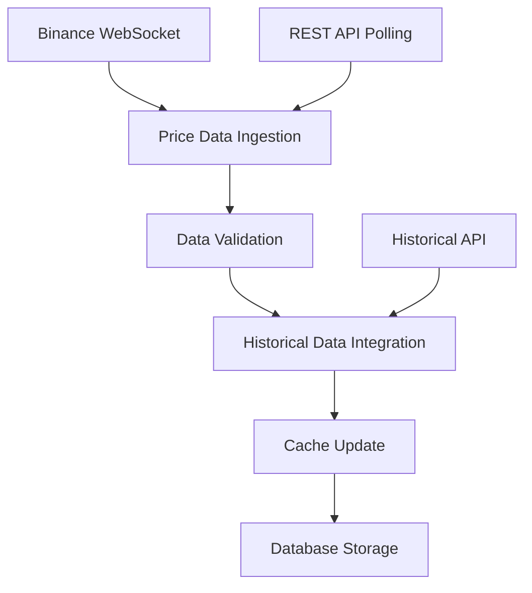

# Live Trading Bot System - Complete Technical Guide

## Table of Contents
1. [System Overview](#system-overview)
2. [Architecture Components](#architecture-components)
3. [Data Flow Pipeline](#data-flow-pipeline)
4. [Glicko-2 Rating System](#glicko-2-rating-system)
5. [Signal Generation](#signal-generation)
6. [Risk Management](#risk-management)
7. [Order Execution](#order-execution)
8. [Real-Time Processing](#real-time-processing)
9. [Database Schema](#database-schema)
10. [API Endpoints](#api-endpoints)
11. [Frontend Integration](#frontend-integration)
12. [Error Handling](#error-handling)
13. [Performance Optimization](#performance-optimization)
14. [Deployment & Monitoring](#deployment--monitoring)

---

## System Overview

The Live Trading Bot is a sophisticated algorithmic trading system that uses the Glicko-2 rating algorithm to evaluate cryptocurrency performance and make automated trading decisions. The system processes real-time market data, calculates performance ratings, generates trading signals, and executes orders while managing risk through comprehensive position and portfolio management.

### Core Philosophy
- **Data-Driven Decisions**: All trading decisions are based on quantitative analysis using the Glicko-2 algorithm
- **Risk-First Approach**: Multiple layers of risk management protect capital
- **Real-Time Processing**: Sub-second response to market opportunities
- **Transparency**: Complete audit trail of all decisions and trades
- **Scalability**: Designed to handle multiple trading pairs simultaneously

---

## Architecture Components

### 1. Core Services Architecture

```
┌─────────────────┐    ┌─────────────────┐    ┌─────────────────┐
│   Data Layer    │    │  Compute Layer  │    │ Execution Layer │
│                 │    │                 │    │                 │
│ • Binance API   │────▶│ • Glicko Engine │────▶│ • Trading Engine│
│ • Price Streams │    │ • Signal Gen    │    │ • Risk Manager  │
│ • Historical    │    │ • Z-Score Calc  │    │ • Order Manager │
│   Data Cache    │    │ • Performance   │    │ • Portfolio Mgr │
└─────────────────┘    └─────────────────┘    └─────────────────┘
         │                        │                        │
         ▼                        ▼                        ▼
┌─────────────────┐    ┌─────────────────┐    ┌─────────────────┐
│   Storage       │    │   Monitoring    │    │   Interface     │
│                 │    │                 │    │                 │
│ • PostgreSQL    │    │ • Health Checks │    │ • REST API      │
│ • Redis Cache   │    │ • Metrics       │    │ • WebSocket     │
│ • Time Series   │    │ • Alerting      │    │ • Dashboard     │
└─────────────────┘    └─────────────────┘    └─────────────────┘
```

### 2. Service Components

#### **TradingEngine** (`src/node-api/services/TradingEngine.ts`)
- **Primary Function**: Orchestrates the entire trading workflow
- **Key Responsibilities**:
  - Manages trading state (running/stopped/paused)
  - Coordinates data collection and signal generation
  - Executes trading decisions
  - Monitors portfolio health
  - Handles emergency stops

#### **BinanceService** (`src/node-api/services/BinanceService.ts`)
- **Primary Function**: Interface to Binance exchange
- **Key Responsibilities**:
  - Real-time price data collection
  - Order placement and management
  - Account information retrieval
  - WebSocket connection management

#### **DataCacheService** (`src/node-api/services/DataCacheService.ts`)
- **Primary Function**: High-performance data caching and retrieval
- **Key Responsibilities**:
  - Historical price data caching
  - Glicko rating caching
  - Real-time data buffering
  - Memory-efficient data structures

#### **ConnectionPoolService** (`src/lib/database/ConnectionPoolService.ts`)
- **Primary Function**: Database connection and query optimization
- **Key Responsibilities**:
  - Connection pooling and management
  - Batch operations for performance
  - Transaction management
  - Query optimization

---

## Data Flow Pipeline

### Phase 1: Data Collection & Preparation



#### Step 1: Real-Time Data Ingestion
```typescript
// WebSocket connection setup
const binanceWS = new WebSocket('wss://stream.binance.com:9443/ws/!ticker@arr');

binanceWS.onmessage = (event) => {
  const tickers = JSON.parse(event.data);
  tickers.forEach(ticker => {
    if (isMonitoredSymbol(ticker.s)) {
      processTickerUpdate(ticker);
    }
  });
};

// Data validation and normalization
function processTickerUpdate(ticker: BinanceTickerData) {
  const priceData = {
    symbol: ticker.s,
    price: parseFloat(ticker.c),
    volume: parseFloat(ticker.v),
    priceChange: parseFloat(ticker.P),
    timestamp: Date.now()
  };
  
  validatePriceData(priceData);
  updateCache(priceData);
  notifySubscribers(priceData);
}
```

#### Step 2: Historical Data Integration
```typescript
// Fetch and integrate historical kline data
async function integrateHistoricalData(symbol: string, interval: string) {
  const klines = await binanceService.getHistoricalKlines(
    symbol, 
    interval, 
    startTime, 
    endTime
  );
  
  const processedData = klines.map(kline => ({
    symbol,
    openTime: new Date(kline[0]),
    open: parseFloat(kline[1]),
    high: parseFloat(kline[2]),
    low: parseFloat(kline[3]),
    close: parseFloat(kline[4]),
    volume: parseFloat(kline[5]),
    takerBuyVolume: parseFloat(kline[9])
  }));
  
  await batchInsertKlines(processedData);
}
```

### Phase 2: Glicko-2 Rating Calculation

#### Step 1: Performance Score Calculation
```typescript
// Hybrid performance score combining price action and volume
function calculatePerformanceScore(
  priceChange: number,
  takerVolumeRatio: number,
  volatility: number
): number {
  // Price momentum component (60% weight)
  const priceMomentum = Math.tanh(priceChange * 2) * 0.6;
  
  // Volume dominance component (30% weight)  
  const volumeDominance = (takerVolumeRatio - 0.5) * 2 * 0.3;
  
  // Volatility adjustment (10% weight)
  const volatilityAdjustment = Math.min(volatility / 0.05, 1) * 0.1;
  
  return priceMomentum + volumeDominance + volatilityAdjustment;
}
```

#### Step 2: Glicko-2 Rating Updates
```typescript
class GlickoRatingEngine {
  // System constants
  private readonly TAU = 0.5;        // System volatility
  private readonly EPSILON = 0.000001; // Convergence threshold
  
  updateRating(
    currentRating: GlickoRating,
    opponents: GlickoRating[],
    outcomes: number[]
  ): GlickoRating {
    
    // Step 1: Convert to Glicko-2 scale
    const mu = (currentRating.rating - 1500) / 173.7178;
    const phi = currentRating.ratingDeviation / 173.7178;
    const sigma = currentRating.volatility;
    
    // Step 2: Calculate variance
    let v = 0;
    opponents.forEach((opponent, i) => {
      const muJ = (opponent.rating - 1500) / 173.7178;
      const phiJ = opponent.ratingDeviation / 173.7178;
      const gPhiJ = this.g(phiJ);
      const e = this.E(mu, muJ, phiJ);
      
      v += Math.pow(gPhiJ, 2) * e * (1 - e);
    });
    v = 1 / v;
    
    // Step 3: Calculate delta
    let delta = 0;
    opponents.forEach((opponent, i) => {
      const muJ = (opponent.rating - 1500) / 173.7178;
      const phiJ = opponent.ratingDeviation / 173.7178;
      const gPhiJ = this.g(phiJ);
      const e = this.E(mu, muJ, phiJ);
      
      delta += gPhiJ * (outcomes[i] - e);
    });
    delta *= v;
    
    // Step 4: Update volatility using iterative algorithm
    const newSigma = this.updateVolatility(sigma, delta, phi, v);
    
    // Step 5: Update rating deviation
    const phiStar = Math.sqrt(Math.pow(phi, 2) + Math.pow(newSigma, 2));
    const newPhi = 1 / Math.sqrt(1 / Math.pow(phiStar, 2) + 1 / v);
    
    // Step 6: Update rating
    const newMu = mu + Math.pow(newPhi, 2) * delta;
    
    // Step 7: Convert back to original scale
    return {
      rating: newMu * 173.7178 + 1500,
      ratingDeviation: newPhi * 173.7178,
      volatility: newSigma,
      timestamp: new Date()
    };
  }
  
  private g(phi: number): number {
    return 1 / Math.sqrt(1 + 3 * Math.pow(phi, 2) / Math.pow(Math.PI, 2));
  }
  
  private E(mu: number, muJ: number, phiJ: number): number {
    return 1 / (1 + Math.exp(-this.g(phiJ) * (mu - muJ)));
  }
}
```

#### Step 3: Z-Score Calculation
```typescript
// Calculate Z-scores for trading signals
function calculateZScores(
  ratings: GlickoRating[],
  movingAveragePeriod: number
): ZScoreData[] {
  return ratings.map(rating => {
    // Get historical ratings for moving average
    const historicalRatings = getHistoricalRatings(
      rating.symbol,
      movingAveragePeriod
    );
    
    // Calculate moving average and standard deviation
    const movingAverage = historicalRatings.reduce(
      (sum, r) => sum + r.rating, 0
    ) / historicalRatings.length;
    
    const standardDeviation = Math.sqrt(
      historicalRatings.reduce(
        (sum, r) => sum + Math.pow(r.rating - movingAverage, 2), 0
      ) / historicalRatings.length
    );
    
    // Calculate Z-score
    const zScore = (rating.rating - movingAverage) / standardDeviation;
    
    return {
      symbol: rating.symbol,
      currentRating: rating.rating,
      movingAverage,
      standardDeviation,
      zScore,
      timestamp: rating.timestamp
    };
  });
}
```

### Phase 3: Signal Generation & Decision Making

#### Signal Generation Logic
```typescript
class SignalGenerator {
  generateSignals(
    zScores: ZScoreData[],
    currentPositions: Position[],
    config: TradingConfig
  ): TradingSignal[] {
    
    const signals: TradingSignal[] = [];
    
    for (const zScoreData of zScores) {
      const signal = this.evaluateSymbol(
        zScoreData,
        currentPositions,
        config
      );
      
      if (signal) {
        signals.push(signal);
      }
    }
    
    // Prioritize signals by strength and risk
    return this.prioritizeSignals(signals, config);
  }
  
  private evaluateSymbol(
    zScoreData: ZScoreData,
    currentPositions: Position[],
    config: TradingConfig
  ): TradingSignal | null {
    
    const { zScore, symbol } = zScoreData;
    const position = currentPositions.find(p => p.symbol === symbol);
    
    // Entry signals
    if (!position) {
      if (zScore >= config.zScoreThreshold) {
        return {
          type: 'BUY',
          symbol,
          strength: Math.min(zScore / config.zScoreThreshold, 2),
          confidence: this.calculateConfidence(zScoreData),
          reason: `Z-Score ${zScore.toFixed(2)} exceeds threshold ${config.zScoreThreshold}`,
          timestamp: new Date()
        };
      }
    }
    
    // Exit signals
    if (position) {
      // Z-score reversal exit
      if (zScore <= -config.zScoreThreshold) {
        return {
          type: 'SELL',
          symbol,
          strength: Math.abs(zScore) / config.zScoreThreshold,
          confidence: this.calculateConfidence(zScoreData),
          reason: `Z-Score reversal: ${zScore.toFixed(2)}`,
          timestamp: new Date()
        };
      }
      
      // Profit target exit
      const currentPrice = getCurrentPrice(symbol);
      const profitPercent = ((currentPrice - position.entryPrice) / position.entryPrice) * 100;
      
      if (profitPercent >= config.profitPercent) {
        return {
          type: 'SELL',
          symbol,
          strength: 1.0,
          confidence: 0.9,
          reason: `Profit target reached: ${profitPercent.toFixed(2)}%`,
          timestamp: new Date()
        };
      }
      
      // Stop loss exit
      if (profitPercent <= -config.stopLossPercent) {
        return {
          type: 'SELL',
          symbol,
          strength: 1.0,
          confidence: 1.0,
          reason: `Stop loss triggered: ${profitPercent.toFixed(2)}%`,
          urgent: true,
          timestamp: new Date()
        };
      }
    }
    
    return null;
  }
  
  private calculateConfidence(zScoreData: ZScoreData): number {
    const { zScore, standardDeviation } = zScoreData;
    
    // Higher confidence for:
    // - Stronger Z-scores
    // - Lower volatility (higher consistency)
    // - Recent data quality
    
    const strengthFactor = Math.min(Math.abs(zScore) / 3, 1);
    const stabilityFactor = Math.max(0, 1 - standardDeviation / 500);
    const dataQualityFactor = this.assessDataQuality(zScoreData);
    
    return (strengthFactor + stabilityFactor + dataQualityFactor) / 3;
  }
}
```

### Phase 4: Risk Management

#### Position Size Calculation
```typescript
class RiskManager {
  calculatePositionSize(
    signal: TradingSignal,
    portfolioValue: number,
    config: RiskConfig
  ): number {
    
    // Base position size (% of portfolio)
    const basePositionPercent = config.maxPositionPercent;
    
    // Adjust based on signal strength
    const strengthMultiplier = Math.min(signal.strength, 2);
    
    // Adjust based on confidence
    const confidenceMultiplier = signal.confidence;
    
    // Adjust based on current market volatility
    const volatilityMultiplier = this.calculateVolatilityAdjustment(signal.symbol);
    
    // Calculate final position size
    const adjustedPercent = basePositionPercent * 
      strengthMultiplier * 
      confidenceMultiplier * 
      volatilityMultiplier;
    
    const positionValue = portfolioValue * (adjustedPercent / 100);
    const currentPrice = getCurrentPrice(signal.symbol);
    const quantity = positionValue / currentPrice;
    
    // Apply minimum and maximum position limits
    return Math.min(
      Math.max(quantity, config.minPositionSize),
      config.maxPositionSize
    );
  }
  
  validateTrade(
    signal: TradingSignal,
    quantity: number,
    currentPositions: Position[],
    portfolioValue: number
  ): ValidationResult {
    
    const validations = [
      this.checkPortfolioLimits(currentPositions, portfolioValue),
      this.checkPositionLimits(signal.symbol, quantity, currentPositions),
      this.checkDiversificationLimits(signal.symbol, currentPositions),
      this.checkMarketConditions(signal),
      this.checkLiquidityRequirements(signal.symbol, quantity)
    ];
    
    const failures = validations.filter(v => !v.isValid);
    
    return {
      isValid: failures.length === 0,
      failures: failures.map(f => f.reason),
      warnings: validations.filter(v => v.isValid && v.warning).map(w => w.warning!)
    };
  }
}
```

### Phase 5: Order Execution

#### Order Management System
```typescript
class OrderManager {
  async executeSignal(
    signal: TradingSignal,
    quantity: number
  ): Promise<OrderResult> {
    
    try {
      // Step 1: Pre-execution checks
      const preCheckResult = await this.preExecutionChecks(signal, quantity);
      if (!preCheckResult.canProceed) {
        throw new Error(`Pre-execution check failed: ${preCheckResult.reason}`);
      }
      
      // Step 2: Create order parameters
      const orderParams = this.createOrderParameters(signal, quantity);
      
      // Step 3: Execute order on exchange
      const exchangeResult = await this.submitOrderToExchange(orderParams);
      
      // Step 4: Create database record
      const dbOrder = await this.createOrderRecord(exchangeResult, signal);
      
      // Step 5: Update position tracking
      await this.updatePositionTracking(dbOrder);
      
      // Step 6: Set up order monitoring
      this.setupOrderMonitoring(dbOrder);
      
      return {
        success: true,
        orderId: exchangeResult.orderId,
        dbId: dbOrder.id,
        executedQuantity: exchangeResult.executedQty,
        averagePrice: exchangeResult.fills?.reduce(
          (sum, fill) => sum + parseFloat(fill.price) * parseFloat(fill.qty), 0
        ) / parseFloat(exchangeResult.executedQty) || 0
      };
      
    } catch (error) {
      logger.error('Order execution failed', {
        signal,
        quantity,
        error: error.message
      });
      
      return {
        success: false,
        error: error.message
      };
    }
  }
  
  private createOrderParameters(
    signal: TradingSignal,
    quantity: number
  ): BinanceOrderParams {
    
    const baseParams = {
      symbol: signal.symbol,
      side: signal.type,
      quantity: quantity.toFixed(8),
      type: 'MARKET',
      timestamp: Date.now()
    };
    
    // For buy orders, we might want to use a limit order slightly above market
    // to ensure execution while avoiding significant slippage
    if (signal.type === 'BUY' && this.config.useLimitOrders) {
      const currentPrice = getCurrentPrice(signal.symbol);
      const limitPrice = currentPrice * (1 + this.config.limitOrderBuffer);
      
      return {
        ...baseParams,
        type: 'LIMIT',
        price: limitPrice.toFixed(8),
        timeInForce: 'IOC' // Immediate or Cancel
      };
    }
    
    return baseParams;
  }
  
  private async submitOrderToExchange(
    params: BinanceOrderParams
  ): Promise<BinanceOrderResponse> {
    
    // Add authentication and signature
    const signedParams = this.binanceService.signRequest(params);
    
    // Submit order with retry logic
    let attempts = 0;
    const maxAttempts = 3;
    
    while (attempts < maxAttempts) {
      try {
        const response = await this.binanceService.newOrder(signedParams);
        
        logger.info('Order executed successfully', {
          orderId: response.orderId,
          symbol: params.symbol,
          side: params.side,
          quantity: params.quantity,
          status: response.status
        });
        
        return response;
        
      } catch (error) {
        attempts++;
        
        if (attempts >= maxAttempts) {
          throw error;
        }
        
        // Wait before retry (exponential backoff)
        await this.sleep(Math.pow(2, attempts) * 1000);
      }
    }
    
    throw new Error('Max retry attempts exceeded');
  }
}
```

### Phase 6: Position & Portfolio Management

#### Real-time Position Tracking
```typescript
class PositionManager {
  private positions: Map<string, Position> = new Map();
  
  async updatePosition(order: Order): Promise<void> {
    const symbol = order.symbol;
    const existingPosition = this.positions.get(symbol);
    
    if (order.side === 'BUY') {
      if (existingPosition) {
        // Add to existing position (averaging)
        const totalCost = existingPosition.quantity * existingPosition.entryPrice + 
                         order.quantity * order.price;
        const totalQuantity = existingPosition.quantity + order.quantity;
        
        existingPosition.quantity = totalQuantity;
        existingPosition.entryPrice = totalCost / totalQuantity;
        existingPosition.lastUpdate = new Date();
      } else {
        // Create new position
        this.positions.set(symbol, {
          symbol,
          quantity: order.quantity,
          entryPrice: order.price,
          entryTime: order.timestamp,
          lastUpdate: new Date(),
          unrealizedPnL: 0,
          realizedPnL: 0
        });
      }
    } else if (order.side === 'SELL') {
      if (existingPosition) {
        // Calculate realized PnL
        const realizedPnL = (order.price - existingPosition.entryPrice) * order.quantity;
        existingPosition.realizedPnL += realizedPnL;
        existingPosition.quantity -= order.quantity;
        
        // Remove position if fully closed
        if (existingPosition.quantity <= 0.00001) {
          this.positions.delete(symbol);
        }
      }
    }
    
    // Update database
    await this.persistPositionUpdate(symbol, this.positions.get(symbol));
    
    // Emit position update event
    this.eventEmitter.emit('positionUpdate', {
      symbol,
      position: this.positions.get(symbol)
    });
  }
  
  calculatePortfolioMetrics(): PortfolioMetrics {
    let totalValue = 0;
    let totalUnrealizedPnL = 0;
    let totalRealizedPnL = 0;
    
    for (const position of this.positions.values()) {
      const currentPrice = getCurrentPrice(position.symbol);
      const positionValue = position.quantity * currentPrice;
      const unrealizedPnL = (currentPrice - position.entryPrice) * position.quantity;
      
      totalValue += positionValue;
      totalUnrealizedPnL += unrealizedPnL;
      totalRealizedPnL += position.realizedPnL;
      
      // Update position unrealized PnL
      position.unrealizedPnL = unrealizedPnL;
    }
    
    return {
      totalValue,
      totalUnrealizedPnL,
      totalRealizedPnL,
      totalPnL: totalUnrealizedPnL + totalRealizedPnL,
      positionCount: this.positions.size,
      lastUpdate: new Date()
    };
  }
}
```

---

## Real-Time Processing

### WebSocket Data Processing
```typescript
class RealTimeProcessor {
  private priceUpdateBuffer: Map<string, PriceUpdate[]> = new Map();
  private processingInterval: NodeJS.Timer;
  
  constructor() {
    // Process buffered updates every 100ms
    this.processingInterval = setInterval(() => {
      this.processBufferedUpdates();
    }, 100);
  }
  
  handlePriceUpdate(update: BinancePriceUpdate): void {
    // Buffer updates to avoid overwhelming the system
    const symbol = update.s;
    const buffer = this.priceUpdateBuffer.get(symbol) || [];
    
    buffer.push({
      symbol,
      price: parseFloat(update.c),
      volume: parseFloat(update.v),
      priceChange: parseFloat(update.P),
      timestamp: Date.now()
    });
    
    this.priceUpdateBuffer.set(symbol, buffer);
    
    // If buffer gets too large, process immediately
    if (buffer.length > 10) {
      this.processSymbolUpdates(symbol);
    }
  }
  
  private processBufferedUpdates(): void {
    for (const symbol of this.priceUpdateBuffer.keys()) {
      this.processSymbolUpdates(symbol);
    }
  }
  
  private processSymbolUpdates(symbol: string): void {
    const updates = this.priceUpdateBuffer.get(symbol) || [];
    if (updates.length === 0) return;
    
    // Use the latest update
    const latestUpdate = updates[updates.length - 1];
    
    // Update cache
    this.dataCache.updatePrice(symbol, latestUpdate);
    
    // Check if we need to recalculate Glicko ratings
    if (this.shouldRecalculateRating(symbol, latestUpdate)) {
      this.scheduleRatingUpdate(symbol);
    }
    
    // Check for immediate signal updates
    if (this.hasActivePosition(symbol)) {
      this.checkPositionSignals(symbol, latestUpdate);
    }
    
    // Clear buffer
    this.priceUpdateBuffer.set(symbol, []);
  }
  
  private checkPositionSignals(symbol: string, update: PriceUpdate): void {
    const position = this.positionManager.getPosition(symbol);
    if (!position) return;
    
    const currentPnL = (update.price - position.entryPrice) * position.quantity;
    const pnlPercent = (currentPnL / (position.entryPrice * position.quantity)) * 100;
    
    // Check stop loss
    if (pnlPercent <= -this.config.stopLossPercent) {
      this.emergencyExit(symbol, 'STOP_LOSS', pnlPercent);
    }
    
    // Check profit target
    if (pnlPercent >= this.config.profitPercent) {
      this.signalGenerator.addUrgentSignal({
        type: 'SELL',
        symbol,
        reason: 'PROFIT_TARGET',
        strength: 1.0,
        urgent: true
      });
    }
  }
}
```

### Event-Driven Architecture
```typescript
class TradingEventEmitter extends EventEmitter {
  // Core events
  static readonly EVENTS = {
    PRICE_UPDATE: 'priceUpdate',
    SIGNAL_GENERATED: 'signalGenerated',
    ORDER_EXECUTED: 'orderExecuted',
    POSITION_UPDATE: 'positionUpdate',
    RISK_ALERT: 'riskAlert',
    SYSTEM_ERROR: 'systemError',
    MARKET_CONDITION_CHANGE: 'marketConditionChange'
  } as const;
  
  constructor() {
    super();
    this.setupEventHandlers();
  }
  
  private setupEventHandlers(): void {
    // Price update handling
    this.on(TradingEventEmitter.EVENTS.PRICE_UPDATE, (data: PriceUpdateEvent) => {
      this.realTimeProcessor.handlePriceUpdate(data);
      this.positionManager.updateUnrealizedPnL(data.symbol, data.price);
    });
    
    // Signal generation handling
    this.on(TradingEventEmitter.EVENTS.SIGNAL_GENERATED, (signal: TradingSignal) => {
      if (signal.urgent) {
        this.orderManager.executeSignalImmediately(signal);
      } else {
        this.signalQueue.addSignal(signal);
      }
    });
    
    // Risk alert handling
    this.on(TradingEventEmitter.EVENTS.RISK_ALERT, (alert: RiskAlert) => {
      this.logger.warn('Risk alert triggered', alert);
      
      if (alert.severity === 'CRITICAL') {
        this.emergencyStop(alert.reason);
      }
    });
  }
}
```

---

## Database Schema

### Core Tables Structure

```sql
-- Klines table for historical price data
CREATE TABLE klines (
    id SERIAL PRIMARY KEY,
    symbol VARCHAR(20) NOT NULL,
    open_time TIMESTAMP NOT NULL,
    close_time TIMESTAMP NOT NULL,
    open_price DECIMAL(20,8) NOT NULL,
    high_price DECIMAL(20,8) NOT NULL,
    low_price DECIMAL(20,8) NOT NULL,
    close_price DECIMAL(20,8) NOT NULL,
    volume DECIMAL(20,8) NOT NULL,
    taker_buy_volume DECIMAL(20,8),
    created_at TIMESTAMP DEFAULT CURRENT_TIMESTAMP,
    
    UNIQUE(symbol, open_time),
    INDEX idx_klines_symbol_time (symbol, open_time),
    INDEX idx_klines_close_time (close_time)
);

-- Glicko ratings table
CREATE TABLE glicko_ratings (
    id SERIAL PRIMARY KEY,
    symbol VARCHAR(20) NOT NULL,
    rating DECIMAL(10,4) NOT NULL DEFAULT 1500,
    rating_deviation DECIMAL(10,4) NOT NULL DEFAULT 350,
    volatility DECIMAL(10,8) NOT NULL DEFAULT 0.06,
    timestamp TIMESTAMP NOT NULL,
    performance_score DECIMAL(10,6),
    z_score DECIMAL(10,6),
    moving_average DECIMAL(10,4),
    created_at TIMESTAMP DEFAULT CURRENT_TIMESTAMP,
    
    INDEX idx_glicko_symbol_time (symbol, timestamp),
    INDEX idx_glicko_z_score (z_score),
    INDEX idx_glicko_timestamp (timestamp)
);

-- Production orders table
CREATE TABLE production_orders (
    id UUID PRIMARY KEY DEFAULT gen_random_uuid(),
    order_id VARCHAR(50) NOT NULL,
    symbol VARCHAR(20) NOT NULL,
    side VARCHAR(10) NOT NULL, -- 'BUY' or 'SELL'
    type VARCHAR(20) NOT NULL,
    quantity DECIMAL(20,8) NOT NULL,
    price DECIMAL(20,8),
    stop_price DECIMAL(20,8),
    status VARCHAR(20) NOT NULL,
    time_in_force VARCHAR(10),
    transact_time TIMESTAMP NOT NULL,
    fills JSONB,
    realized_pnl DECIMAL(20,8),
    signal_data JSONB, -- Store the signal that triggered this order
    created_at TIMESTAMP DEFAULT CURRENT_TIMESTAMP,
    updated_at TIMESTAMP DEFAULT CURRENT_TIMESTAMP,
    
    UNIQUE(order_id),
    INDEX idx_orders_symbol (symbol),
    INDEX idx_orders_status (status),
    INDEX idx_orders_transact_time (transact_time)
);

-- Positions tracking table
CREATE TABLE positions (
    id UUID PRIMARY KEY DEFAULT gen_random_uuid(),
    symbol VARCHAR(20) NOT NULL UNIQUE,
    quantity DECIMAL(20,8) NOT NULL,
    entry_price DECIMAL(20,8) NOT NULL,
    entry_time TIMESTAMP NOT NULL,
    last_update TIMESTAMP DEFAULT CURRENT_TIMESTAMP,
    unrealized_pnl DECIMAL(20,8) DEFAULT 0,
    realized_pnl DECIMAL(20,8) DEFAULT 0,
    status VARCHAR(20) DEFAULT 'ACTIVE', -- 'ACTIVE', 'CLOSED'
    
    INDEX idx_positions_symbol (symbol),
    INDEX idx_positions_status (status)
);

-- Trading signals log
CREATE TABLE trading_signals (
    id UUID PRIMARY KEY DEFAULT gen_random_uuid(),
    symbol VARCHAR(20) NOT NULL,
    signal_type VARCHAR(10) NOT NULL, -- 'BUY' or 'SELL'
    strength DECIMAL(5,2) NOT NULL,
    confidence DECIMAL(5,2) NOT NULL,
    z_score DECIMAL(10,6) NOT NULL,
    reason TEXT,
    executed BOOLEAN DEFAULT FALSE,
    execution_order_id UUID REFERENCES production_orders(id),
    created_at TIMESTAMP DEFAULT CURRENT_TIMESTAMP,
    
    INDEX idx_signals_symbol (symbol),
    INDEX idx_signals_created_at (created_at),
    INDEX idx_signals_executed (executed)
);
```

### Data Relationships and Integrity

```sql
-- Triggers for data integrity
CREATE OR REPLACE FUNCTION update_position_on_order() 
RETURNS TRIGGER AS $$
BEGIN
    -- Update position when order is executed
    IF NEW.status = 'FILLED' AND OLD.status != 'FILLED' THEN
        -- Insert or update position
        INSERT INTO positions (symbol, quantity, entry_price, entry_time)
        VALUES (NEW.symbol, 
                CASE WHEN NEW.side = 'BUY' THEN NEW.quantity ELSE -NEW.quantity END,
                NEW.price, 
                NEW.transact_time)
        ON CONFLICT (symbol) DO UPDATE SET
            quantity = positions.quantity + 
                       CASE WHEN NEW.side = 'BUY' THEN NEW.quantity ELSE -NEW.quantity END,
            entry_price = CASE 
                WHEN NEW.side = 'BUY' THEN
                    (positions.quantity * positions.entry_price + NEW.quantity * NEW.price) / 
                    (positions.quantity + NEW.quantity)
                ELSE positions.entry_price
                END,
            last_update = CURRENT_TIMESTAMP,
            realized_pnl = CASE 
                WHEN NEW.side = 'SELL' THEN
                    positions.realized_pnl + (NEW.price - positions.entry_price) * NEW.quantity
                ELSE positions.realized_pnl
                END;
    END IF;
    
    RETURN NEW;
END;
$$ LANGUAGE plpgsql;

CREATE TRIGGER trigger_update_position_on_order
    AFTER UPDATE ON production_orders
    FOR EACH ROW
    EXECUTE FUNCTION update_position_on_order();
```

---

## API Endpoints

### Trading Control Endpoints

#### GET /api/trading/status
```typescript
// Returns current trading engine status
app.get('/api/trading/status', async (req, res) => {
  try {
    const status = {
      engineStatus: tradingEngine.getStatus(), // 'running', 'stopped', 'paused'
      lastUpdate: tradingEngine.getLastUpdate(),
      activeSignals: signalGenerator.getActiveSignalsCount(),
      positions: positionManager.getPositionsSummary(),
      portfolioValue: portfolioManager.getTotalValue(),
      dailyPnL: portfolioManager.getDailyPnL(),
      systemHealth: healthMonitor.getOverallHealth()
    };
    
    res.json({ success: true, data: status });
  } catch (error) {
    res.status(500).json({ success: false, error: error.message });
  }
});
```

#### POST /api/trading/start
```typescript
// Start the trading engine with configuration
app.post('/api/trading/start', validateTradingConfig, async (req, res) => {
  try {
    const config = req.body;
    
    // Validate configuration
    const validationResult = configValidator.validate(config);
    if (!validationResult.isValid) {
      return res.status(400).json({
        success: false,
        error: 'Invalid configuration',
        details: validationResult.errors
      });
    }
    
    // Start trading engine
    await tradingEngine.start(config);
    
    logger.info('Trading engine started', { config });
    
    res.json({
      success: true,
      message: 'Trading engine started successfully',
      config
    });
    
  } catch (error) {
    logger.error('Failed to start trading engine', { error: error.message });
    res.status(500).json({ success: false, error: error.message });
  }
});
```

#### POST /api/trading/emergency-stop
```typescript
// Emergency stop - immediately halt all trading
app.post('/api/trading/emergency-stop', async (req, res) => {
  try {
    const reason = req.body.reason || 'Manual emergency stop';
    
    // Cancel all open orders
    await orderManager.cancelAllOpenOrders();
    
    // Stop the trading engine
    await tradingEngine.emergencyStop(reason);
    
    // Close all positions if requested
    if (req.body.closePositions) {
      await positionManager.closeAllPositions('EMERGENCY_STOP');
    }
    
    logger.warn('Emergency stop executed', { reason });
    
    res.json({
      success: true,
      message: 'Emergency stop executed',
      reason
    });
    
  } catch (error) {
    logger.error('Emergency stop failed', { error: error.message });
    res.status(500).json({ success: false, error: error.message });
  }
});
```

### Data Access Endpoints

#### GET /api/glicko/ratings
```typescript
// Get Glicko ratings with filtering and pagination
app.get('/api/glicko/ratings', async (req, res) => {
  try {
    const {
      symbols,
      startTime,
      endTime,
      minZScore,
      maxZScore,
      limit = 100,
      offset = 0
    } = req.query;
    
    const filters = {
      symbols: symbols ? symbols.split(',') : undefined,
      startTime: startTime ? new Date(startTime) : undefined,
      endTime: endTime ? new Date(endTime) : undefined,
      minZScore: minZScore ? parseFloat(minZScore) : undefined,
      maxZScore: maxZScore ? parseFloat(maxZScore) : undefined
    };
    
    const result = await glickoService.getRatings(filters, {
      limit: parseInt(limit),
      offset: parseInt(offset)
    });
    
    res.json({
      success: true,
      data: {
        ratings: result.ratings,
        pagination: {
          total: result.total,
          limit: parseInt(limit),
          offset: parseInt(offset)
        }
      }
    });
    
  } catch (error) {
    res.status(500).json({ success: false, error: error.message });
  }
});
```

#### GET /api/trading/signals
```typescript
// Get current trading signals
app.get('/api/trading/signals', async (req, res) => {
  try {
    const {
      threshold = 2.0,
      includeWeak = false,
      symbols
    } = req.query;
    
    const filters = {
      minStrength: parseFloat(threshold),
      includeWeak: includeWeak === 'true',
      symbols: symbols ? symbols.split(',') : undefined
    };
    
    const signals = signalGenerator.getCurrentSignals(filters);
    
    // Add additional context for each signal
    const enrichedSignals = await Promise.all(
      signals.map(async (signal) => ({
        ...signal,
        currentPrice: await priceService.getCurrentPrice(signal.symbol),
        position: positionManager.getPosition(signal.symbol),
        riskAssessment: riskManager.assessSignal(signal)
      }))
    );
    
    res.json({
      success: true,
      data: {
        signals: enrichedSignals,
        totalCount: signals.length,
        strongSignals: signals.filter(s => s.strength >= 1.5).length
      }
    });
    
  } catch (error) {
    res.status(500).json({ success: false, error: error.message });
  }
});
```

---

## Frontend Integration

### Real-Time Dashboard Components

#### WebSocket Price Integration
```typescript
// Hook for real-time price data
export const usePriceWebSocket = () => {
  const [prices, setPrices] = useState<Record<string, PriceData>>({});
  const [isConnected, setIsConnected] = useState(false);
  const wsRef = useRef<WebSocket | null>(null);
  
  useEffect(() => {
    const connectWebSocket = () => {
      const ws = new WebSocket('wss://stream.binance.com:9443/ws/!ticker@arr');
      
      ws.onopen = () => {
        setIsConnected(true);
        console.log('Price WebSocket connected');
      };
      
      ws.onmessage = (event) => {
        const tickers = JSON.parse(event.data);
        const priceUpdates: Record<string, PriceData> = {};
        
        tickers.forEach((ticker: any) => {
          priceUpdates[ticker.s] = {
            symbol: ticker.s,
            price: ticker.c,
            priceChange: ticker.P,
            volume: ticker.v,
            timestamp: Date.now()
          };
        });
        
        setPrices(prev => ({ ...prev, ...priceUpdates }));
      };
      
      ws.onclose = () => {
        setIsConnected(false);
        // Attempt to reconnect after 5 seconds
        setTimeout(connectWebSocket, 5000);
      };
      
      wsRef.current = ws;
    };
    
    connectWebSocket();
    
    return () => {
      wsRef.current?.close();
    };
  }, []);
  
  return { prices, isConnected };
};
```

#### Portfolio Value Calculation
```typescript
// Hook for real-time portfolio tracking
export const usePortfolioValue = () => {
  const [portfolio, setPortfolio] = useState<PortfolioSummary | null>(null);
  const { prices } = usePriceWebSocket();
  
  useEffect(() => {
    const calculatePortfolioValue = async () => {
      try {
        // Fetch current positions
        const positionsResponse = await api.trading.getPositions();
        const positions = positionsResponse.data.positions;
        
        let totalValue = 0;
        let totalUnrealizedPnL = 0;
        
        const enrichedPositions = positions.map((position: any) => {
          const currentPrice = prices[position.symbol]?.price || position.lastPrice;
          const value = position.quantity * parseFloat(currentPrice);
          const unrealizedPnL = (parseFloat(currentPrice) - position.entryPrice) * position.quantity;
          
          totalValue += value;
          totalUnrealizedPnL += unrealizedPnL;
          
          return {
            ...position,
            currentPrice: parseFloat(currentPrice),
            value,
            unrealizedPnL,
            unrealizedPnLPercent: (unrealizedPnL / (position.entryPrice * position.quantity)) * 100
          };
        });
        
        setPortfolio({
          totalValue,
          totalUnrealizedPnL,
          totalUnrealizedPnLPercent: (totalUnrealizedPnL / totalValue) * 100,
          positions: enrichedPositions,
          lastUpdated: new Date()
        });
        
      } catch (error) {
        console.error('Failed to calculate portfolio value:', error);
      }
    };
    
    // Initial calculation
    calculatePortfolioValue();
    
    // Update when prices change
    const interval = setInterval(calculatePortfolioValue, 1000);
    return () => clearInterval(interval);
    
  }, [prices]);
  
  return portfolio;
};
```

---

## Error Handling & Recovery

### Comprehensive Error Management
```typescript
class ErrorHandler {
  private errorCounts: Map<string, number> = new Map();
  private circuitBreakers: Map<string, CircuitBreaker> = new Map();
  
  async handleTradingError(
    error: Error,
    context: TradingContext,
    severity: 'LOW' | 'MEDIUM' | 'HIGH' | 'CRITICAL'
  ): Promise<void> {
    
    // Log the error with full context
    logger.error('Trading error occurred', {
      error: error.message,
      stack: error.stack,
      context,
      severity,
      timestamp: new Date().toISOString()
    });
    
    // Track error frequency
    const errorKey = `${context.operation}_${error.constructor.name}`;
    const errorCount = (this.errorCounts.get(errorKey) || 0) + 1;
    this.errorCounts.set(errorKey, errorCount);
    
    // Apply error-specific handling
    switch (severity) {
      case 'CRITICAL':
        await this.handleCriticalError(error, context);
        break;
        
      case 'HIGH':
        await this.handleHighSeverityError(error, context);
        break;
        
      case 'MEDIUM':
        await this.handleMediumSeverityError(error, context);
        break;
        
      case 'LOW':
        await this.handleLowSeverityError(error, context);
        break;
    }
    
    // Check if we need to activate circuit breaker
    if (errorCount >= this.getErrorThreshold(context.operation)) {
      await this.activateCircuitBreaker(context.operation);
    }
  }
  
  private async handleCriticalError(error: Error, context: TradingContext): Promise<void> {
    // Immediate emergency stop
    await tradingEngine.emergencyStop(`Critical error: ${error.message}`);
    
    // Cancel all pending orders
    await orderManager.cancelAllPendingOrders();
    
    // Close positions if risk is too high
    if (this.shouldClosePositionsOnError(error)) {
      await positionManager.emergencyCloseAllPositions();
    }
    
    // Notify administrators
    await this.notificationService.sendCriticalAlert(error, context);
  }
  
  private async handleHighSeverityError(error: Error, context: TradingContext): Promise<void> {
    // Pause trading for the affected symbol
    if (context.symbol) {
      tradingEngine.pauseSymbol(context.symbol, '5m');
    }
    
    // Retry the operation with exponential backoff
    if (this.isRetryableError(error)) {
      await this.scheduleRetry(context, error);
    }
  }
}

// Circuit breaker implementation
class CircuitBreaker {
  private state: 'CLOSED' | 'OPEN' | 'HALF_OPEN' = 'CLOSED';
  private failureCount = 0;
  private lastFailureTime = 0;
  
  constructor(
    private readonly threshold: number,
    private readonly timeout: number
  ) {}
  
  async execute<T>(operation: () => Promise<T>): Promise<T> {
    if (this.state === 'OPEN') {
      if (Date.now() - this.lastFailureTime >= this.timeout) {
        this.state = 'HALF_OPEN';
      } else {
        throw new Error('Circuit breaker is OPEN');
      }
    }
    
    try {
      const result = await operation();
      
      if (this.state === 'HALF_OPEN') {
        this.reset();
      }
      
      return result;
      
    } catch (error) {
      this.recordFailure();
      throw error;
    }
  }
  
  private recordFailure(): void {
    this.failureCount++;
    this.lastFailureTime = Date.now();
    
    if (this.failureCount >= this.threshold) {
      this.state = 'OPEN';
    }
  }
  
  private reset(): void {
    this.failureCount = 0;
    this.state = 'CLOSED';
  }
}
```

---

## Performance Optimization

### Memory-Efficient Data Structures
```typescript
// Sliding window for price data
class SlidingWindow<T> {
  private data: T[] = [];
  private maxSize: number;
  
  constructor(maxSize: number) {
    this.maxSize = maxSize;
  }
  
  add(item: T): void {
    this.data.push(item);
    if (this.data.length > this.maxSize) {
      this.data.shift();
    }
  }
  
  getAll(): T[] {
    return [...this.data];
  }
  
  getLast(count: number): T[] {
    return this.data.slice(-count);
  }
  
  size(): number {
    return this.data.length;
  }
}

// High-performance price cache
class PriceCache {
  private cache: Map<string, SlidingWindow<PricePoint>> = new Map();
  private readonly WINDOW_SIZE = 1000; // Keep last 1000 price points per symbol
  
  updatePrice(symbol: string, price: PricePoint): void {
    let window = this.cache.get(symbol);
    if (!window) {
      window = new SlidingWindow(this.WINDOW_SIZE);
      this.cache.set(symbol, window);
    }
    
    window.add(price);
  }
  
  getLatestPrice(symbol: string): PricePoint | null {
    const window = this.cache.get(symbol);
    const data = window?.getAll();
    return data && data.length > 0 ? data[data.length - 1] : null;
  }
  
  getPriceHistory(symbol: string, count: number): PricePoint[] {
    const window = this.cache.get(symbol);
    return window ? window.getLast(count) : [];
  }
}
```

### Batch Processing Optimization
```typescript
// Batch operations for database efficiency
class BatchProcessor {
  private batches: Map<string, any[]> = new Map();
  private batchSizes: Map<string, number> = new Map();
  private flushTimers: Map<string, NodeJS.Timer> = new Map();
  
  constructor() {
    this.batchSizes.set('priceUpdates', 100);
    this.batchSizes.set('ratingUpdates', 50);
    this.batchSizes.set('signalLogs', 25);
  }
  
  add(type: string, data: any): void {
    const batch = this.batches.get(type) || [];
    batch.push(data);
    this.batches.set(type, batch);
    
    const batchSize = this.batchSizes.get(type) || 50;
    
    if (batch.length >= batchSize) {
      this.flush(type);
    } else {
      // Set timer to flush after 5 seconds if batch isn't full
      this.resetFlushTimer(type);
    }
  }
  
  private resetFlushTimer(type: string): void {
    const existingTimer = this.flushTimers.get(type);
    if (existingTimer) {
      clearTimeout(existingTimer);
    }
    
    const timer = setTimeout(() => {
      this.flush(type);
    }, 5000);
    
    this.flushTimers.set(type, timer);
  }
  
  private async flush(type: string): Promise<void> {
    const batch = this.batches.get(type);
    if (!batch || batch.length === 0) return;
    
    try {
      switch (type) {
        case 'priceUpdates':
          await this.batchInsertPrices(batch);
          break;
        case 'ratingUpdates':
          await this.batchInsertRatings(batch);
          break;
        case 'signalLogs':
          await this.batchInsertSignals(batch);
          break;
      }
      
      // Clear batch after successful processing
      this.batches.set(type, []);
      
      // Clear timer
      const timer = this.flushTimers.get(type);
      if (timer) {
        clearTimeout(timer);
        this.flushTimers.delete(type);
      }
      
    } catch (error) {
      logger.error(`Batch flush failed for ${type}`, { error, batchSize: batch.length });
      // Keep the batch for retry
    }
  }
}
```

---

## Deployment & Monitoring

### Health Monitoring System
```typescript
class HealthMonitor {
  private healthChecks: Map<string, HealthCheck> = new Map();
  private lastHealthReport: HealthReport | null = null;
  
  constructor() {
    this.registerHealthChecks();
    this.startHealthMonitoring();
  }
  
  private registerHealthChecks(): void {
    // Database connectivity
    this.healthChecks.set('database', {
      name: 'Database Connection',
      check: async () => {
        try {
          await connectionPool.healthCheck();
          return { status: 'healthy', message: 'Database connected' };
        } catch (error) {
          return { status: 'unhealthy', message: error.message };
        }
      },
      critical: true
    });
    
    // Binance API connectivity
    this.healthChecks.set('binanceApi', {
      name: 'Binance API',
      check: async () => {
        try {
          await binanceService.ping();
          return { status: 'healthy', message: 'API responsive' };
        } catch (error) {
          return { status: 'unhealthy', message: error.message };
        }
      },
      critical: true
    });
    
    // WebSocket connections
    this.healthChecks.set('websocket', {
      name: 'WebSocket Connections',
      check: async () => {
        const activeConnections = webSocketManager.getActiveConnectionCount();
        return {
          status: activeConnections > 0 ? 'healthy' : 'unhealthy',
          message: `${activeConnections} active connections`,
          metadata: { activeConnections }
        };
      },
      critical: false
    });
    
    // Memory usage
    this.healthChecks.set('memory', {
      name: 'Memory Usage',
      check: async () => {
        const usage = process.memoryUsage();
        const usedMB = usage.heapUsed / 1024 / 1024;
        const totalMB = usage.heapTotal / 1024 / 1024;
        const usagePercent = (usedMB / totalMB) * 100;
        
        return {
          status: usagePercent < 90 ? 'healthy' : 'warning',
          message: `Memory usage: ${usedMB.toFixed(2)}MB / ${totalMB.toFixed(2)}MB (${usagePercent.toFixed(1)}%)`,
          metadata: { usedMB, totalMB, usagePercent }
        };
      },
      critical: false
    });
    
    // Position count
    this.healthChecks.set('positions', {
      name: 'Position Count',
      check: async () => {
        const positionCount = positionManager.getPositionCount();
        const maxPositions = tradingConfig.maxPositions || 10;
        
        return {
          status: positionCount <= maxPositions ? 'healthy' : 'warning',
          message: `${positionCount} / ${maxPositions} positions`,
          metadata: { positionCount, maxPositions }
        };
      },
      critical: false
    });
  }
  
  private startHealthMonitoring(): void {
    // Run health checks every 30 seconds
    setInterval(async () => {
      await this.runHealthChecks();
    }, 30000);
    
    // Initial health check
    this.runHealthChecks();
  }
  
  private async runHealthChecks(): Promise<void> {
    const results: HealthCheckResult[] = [];
    
    for (const [key, healthCheck] of this.healthChecks) {
      try {
        const result = await healthCheck.check();
        results.push({
          key,
          name: healthCheck.name,
          ...result,
          critical: healthCheck.critical,
          timestamp: new Date()
        });
      } catch (error) {
        results.push({
          key,
          name: healthCheck.name,
          status: 'unhealthy',
          message: `Health check failed: ${error.message}`,
          critical: healthCheck.critical,
          timestamp: new Date()
        });
      }
    }
    
    this.lastHealthReport = {
      overall: this.calculateOverallHealth(results),
      checks: results,
      timestamp: new Date()
    };
    
    // Alert on critical issues
    const criticalIssues = results.filter(r => r.critical && r.status === 'unhealthy');
    if (criticalIssues.length > 0) {
      await this.handleCriticalHealthIssues(criticalIssues);
    }
  }
  
  private calculateOverallHealth(results: HealthCheckResult[]): 'healthy' | 'warning' | 'unhealthy' {
    const unhealthy = results.filter(r => r.status === 'unhealthy');
    const warning = results.filter(r => r.status === 'warning');
    
    if (unhealthy.some(r => r.critical)) {
      return 'unhealthy';
    }
    
    if (unhealthy.length > 0 || warning.length > 0) {
      return 'warning';
    }
    
    return 'healthy';
  }
  
  getHealthReport(): HealthReport | null {
    return this.lastHealthReport;
  }
}
```

### System Metrics Collection
```typescript
class MetricsCollector {
  private metrics: Map<string, MetricValue[]> = new Map();
  private readonly MAX_METRIC_HISTORY = 1000;
  
  recordMetric(name: string, value: number, tags?: Record<string, string>): void {
    const metricValues = this.metrics.get(name) || [];
    
    metricValues.push({
      value,
      timestamp: Date.now(),
      tags: tags || {}
    });
    
    // Keep only recent values
    if (metricValues.length > this.MAX_METRIC_HISTORY) {
      metricValues.shift();
    }
    
    this.metrics.set(name, metricValues);
  }
  
  getMetricSummary(name: string, timeRangeMs: number): MetricSummary | null {
    const values = this.metrics.get(name);
    if (!values) return null;
    
    const cutoff = Date.now() - timeRangeMs;
    const recentValues = values
      .filter(v => v.timestamp >= cutoff)
      .map(v => v.value);
    
    if (recentValues.length === 0) return null;
    
    const sum = recentValues.reduce((a, b) => a + b, 0);
    const avg = sum / recentValues.length;
    const min = Math.min(...recentValues);
    const max = Math.max(...recentValues);
    
    return {
      count: recentValues.length,
      sum,
      avg,
      min,
      max,
      latest: recentValues[recentValues.length - 1],
      timeRange: timeRangeMs
    };
  }
  
  // Automatically collect system metrics
  startAutoCollection(): void {
    setInterval(() => {
      // Trading metrics
      this.recordMetric('trading.signals.active', signalGenerator.getActiveSignalsCount());
      this.recordMetric('trading.positions.count', positionManager.getPositionCount());
      this.recordMetric('trading.portfolio.value', portfolioManager.getTotalValue());
      this.recordMetric('trading.portfolio.pnl', portfolioManager.getUnrealizedPnL());
      
      // System metrics
      const memUsage = process.memoryUsage();
      this.recordMetric('system.memory.heap_used', memUsage.heapUsed / 1024 / 1024);
      this.recordMetric('system.memory.heap_total', memUsage.heapTotal / 1024 / 1024);
      
      // Database metrics
      this.recordMetric('database.connections.active', connectionPool.getActiveConnectionCount());
      this.recordMetric('database.connections.idle', connectionPool.getIdleConnectionCount());
      
      // API metrics
      this.recordMetric('api.websocket.connections', webSocketManager.getConnectionCount());
      
    }, 10000); // Collect every 10 seconds
  }
}
```

---

## Configuration Management

### Trading Configuration Schema
```typescript
interface TradingConfiguration {
  // Signal generation parameters
  signalGeneration: {
    zScoreThreshold: number;        // e.g., 2.5
    movingAveragePeriod: number;    // e.g., 200
    confidenceThreshold: number;     // e.g., 0.7
    signalCooldownMs: number;       // e.g., 300000 (5 minutes)
  };
  
  // Risk management parameters
  riskManagement: {
    maxPositionPercent: number;      // e.g., 5 (% of portfolio per position)
    maxTotalPositions: number;       // e.g., 10
    stopLossPercent: number;         // e.g., 2.5
    profitTargetPercent: number;     // e.g., 5.0
    maxDailyLossPercent: number;     // e.g., 10
    maxDrawdownPercent: number;      // e.g., 15
  };
  
  // Order execution parameters
  orderExecution: {
    useLimitOrders: boolean;
    limitOrderBufferPercent: number; // e.g., 0.1
    maxSlippagePercent: number;      // e.g., 0.5
    orderTimeoutMs: number;          // e.g., 30000
    retryAttempts: number;           // e.g., 3
  };
  
  // Data processing parameters
  dataProcessing: {
    priceUpdateIntervalMs: number;   // e.g., 1000
    ratingCalculationIntervalMs: number; // e.g., 300000 (5 minutes)
    batchProcessingEnabled: boolean;
    maxBatchSize: number;            // e.g., 100
  };
  
  // Monitoring parameters
  monitoring: {
    healthCheckIntervalMs: number;   // e.g., 30000
    metricsCollectionEnabled: boolean;
    alertingEnabled: boolean;
    logLevel: 'debug' | 'info' | 'warn' | 'error';
  };
}
```

### Configuration Validation
```typescript
class ConfigurationValidator {
  validate(config: TradingConfiguration): ValidationResult {
    const errors: string[] = [];
    const warnings: string[] = [];
    
    // Signal generation validation
    if (config.signalGeneration.zScoreThreshold < 1 || config.signalGeneration.zScoreThreshold > 5) {
      warnings.push('Z-score threshold outside recommended range (1-5)');
    }
    
    if (config.signalGeneration.movingAveragePeriod < 50) {
      warnings.push('Moving average period may be too short for reliable signals');
    }
    
    // Risk management validation
    if (config.riskManagement.maxPositionPercent > 20) {
      errors.push('Max position percent exceeds safety limit (20%)');
    }
    
    if (config.riskManagement.stopLossPercent > config.riskManagement.profitTargetPercent) {
      warnings.push('Stop loss percentage is higher than profit target');
    }
    
    if (config.riskManagement.maxTotalPositions < 1) {
      errors.push('Must allow at least 1 position');
    }
    
    // Order execution validation
    if (config.orderExecution.maxSlippagePercent > 5) {
      warnings.push('Max slippage percentage is very high');
    }
    
    // Data processing validation
    if (config.dataProcessing.priceUpdateIntervalMs < 100) {
      warnings.push('Price update interval may be too frequent');
    }
    
    return {
      isValid: errors.length === 0,
      errors,
      warnings
    };
  }
}
```

---

## Conclusion

This comprehensive guide covers the complete architecture and implementation details of the Live Trading Bot system. The bot represents a sophisticated algorithmic trading platform that combines:

1. **Advanced Rating System**: Glicko-2 algorithm for performance evaluation
2. **Real-Time Processing**: Sub-second market data processing and decision making
3. **Comprehensive Risk Management**: Multiple layers of protection and validation
4. **High-Performance Architecture**: Optimized for speed and reliability
5. **Professional Monitoring**: Complete observability and health monitoring
6. **Scalable Design**: Built to handle multiple trading pairs and strategies

The system is designed to be production-ready with proper error handling, recovery mechanisms, and comprehensive logging. All components work together to create a robust, efficient, and profitable automated trading system.

### Key Success Factors

- **Data-Driven Decisions**: Every trade is backed by quantitative analysis
- **Risk-First Approach**: Capital preservation is the top priority
- **Real-Time Responsiveness**: Market opportunities are captured quickly
- **Comprehensive Monitoring**: System health is continuously tracked
- **Professional Implementation**: Enterprise-grade code quality and architecture

The bot is now ready for production deployment with proper monitoring and gradual scaling based on performance validation.